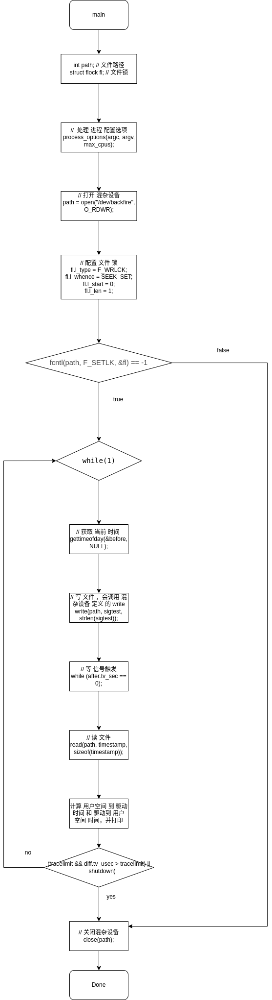

# 概述

## backfire

从形式上看是一个内核模块，从内容上看是一个misc设备的驱动。它如收到一个信号，则记录下当前的时刻。

它从/dev/backfire里读取信息，然后把信息发给调用的程序。

从/dev/backfire里读到的应该是一个时间，但如果没有收到信号则读到的是0。

这个时间是从1970-01-01 00:00:00 UTC开始计时，逗号前面是秒，逗号后面是微秒。

backfire一般是和sendme配合使用，以测试内核发送信号的性能。

## sendme

用户向自己发送一个信号，记录信号从用户到内核的时延，以及信号再从内核到用户所用的时延。

backfire和sendme的代码一共有397行，不包括空行。


## 思路
准备一些配置参数，在主线程中初始化好线程需要的变量，根据线程数量启动线程数量个线程对,通过pthread_mutex_lock(),pthread_mutex_unlock()方式同步线程,并在前后使用gettimeofday测量释放和获取锁之间的延迟。主线程负责统计性能。
## 原理

使用两种 信号量 ， testmutex 和 syncmutex , testmutex 使用来测试延迟的，syncmutex是用来同步 ,接受发送的。并且 testmutex 全部上锁。

每设置 一个 线程对，要开启两个线程 一个 sender 一个 receiver，

在 一个 线程对里 ， sender 方 ，先对 syncmutex 上锁，然后 获取 当前时间，然后 在 testmutex 解锁。

received 线程 ，上来 对 testmutex 上锁，因为 在线程开始前，testmutex 是锁着的所以等待，当sender方，释放锁后，获得执行，立刻统计当前时间，然后对 syncmutex，解锁。

这样 统计 两个时间差，能计算出 信号量 使用 了 多少延时。


# 使用

## 编译

当rt-tests测试套件安装完成后，本程序就被安装在/usr/local/bin目录下。

```c++
# 编译安装rt-tests测试套件
sudo apt-get install build-essential libnuma-dev    # 安装编译环境和必需的库
git clone git://git.kernel.org/pub/scm/utils/rt-tests/rt-tests.git
cd rt-tests
git checkout stable/v1.0    # master分支不是稳定版，所以要切换到stable分支
make all
make install
```
## 参数

```bash
-a, --affinity[=PROC]	# 设置亲和性。如未指定PROC，则运行在当前的处理器核上。
-b, --breaktrace=<USEC>	# 当 时延 > USEC 时，发送中断跟踪命令。这是一个调试选项。
-i, --interval=<INTV>	# 线程的基本间隔，单位是us 默认=1000。
-l, --loops=<LOOPS>		# 循环次数：默认=0（无尽）。
-p, --prio=<PRIO>		# 优先级。
```
## 数据含义

```
To : 代表用户发出信号到内核收到信号所用的时间
From : 代表内核发出信号到用户收到信号所用的时间
Min : 所有时间里的最小值
Cur : 最后一次记录到的时间
Avg : 时间的平均值
Max : 所有时间里的最大值
```


## 例子

由于本程序长时间未维护，内核模块已无法编译。

# 代码解析

## 执行过程解析

1. 执行process_options()函数以处理传入的参数。
    1. 执行sysconf()函数以获取处理器的数量
    2. 在一个for(;;)循环里通过getopt_long()解析参数，解析完毕则退出此循环。
        1. 参数-a会修改全局变量affinity，并设置全局变量setaffinity为AFFINITY_SPECIFIED。
        2. 参数-b会修改全局变量tracelimit，中断跟踪的条件。
        3. 参数-i会修改全局变量interval，线程间基本间隔。
        4. 参数-l会修改全局变量max_cycles，循环次数。
        5. 参数-p会修改全局变量priority，优先级。
        6. 参数?会修改全局变量error=1。
    3. 如affinity与CPU编号范围不一致，则error=1。
    4. 如priority在0~99之外，则error=1。
    5. 如error!=0，则执行dislpay_help()。即打印帮助选项并退出。
2. 执行check_privs()以检查当前的的调度策略是否SCHED_FIFO或SCHED_RR。
3. 执行mlockall()锁定内存防止换出。
4. 依据用户要求的优先级，使用sched_setscheduler()设置当前线程的优先级。
5. 依据用户要求或系统默认的亲和性，使用sched_setaffinity()设置当前线程的亲和性。
6. 打开设备"/dev/backfire"。
7. 使用fcntl()给设备"/dev/backfire"加上写保护锁。
8. 如用户传入了参数-b，则调用kernvar()。
9. 如收到信号SIGHUP, SIGINT, SIGTERM则调用signalhandler()处理。
    1. 使用gettimeofday()将时间赋值给全局变量after
    2. 如收到的信号是SIGINT和SIGTERM，则将全局变量shutdown赋值为1。
10. 在一个while(1)循环内：
    1. 使用gettimeofday()记录时间到变量before。
    2. 使用write()把sigtest写入"/dev/backfire"(sigtest当前内容是SIGHUP)。
    3. 使用read()把"/dev/backfire"的内容读取到timestamp。
    4. 使用sscanf()把timestamp的内容写入到sendtime里。
    5. diffno++，如diffno达到用户设定的循环次数，则shutdown=1.
    6. 使用timersub()计算sendtime减before的值，记录在diff里
    7. 分别用mindiff1和maxdiff1记录下diff里的历史最小值和历史最大值
    8. 用sumdiff1记录下diff的历史总和
    9. 使用printf()输出Min, Cur, Avg, Max的值。
    10. 使用timersub()计算after减sendtime的值，记录在diff里
    11. 分别用mindiff2, maxdiff2, sumdiff2记录下相应的值
    12. 使用printf()输出Min, Cur, Avg, Max的值。
    13. 清空after.tv_sec
    14. 如果diff记录的时间超过了用户-b参数的设定，或shutdown非0的条件下，如果用户设定了-b参数则执行stop_tracing()，执行break跳出while循环。
    15. 调用nanosleop睡眠
11. 使用close()关闭"/dev/backfire"
12. 执行return返回


# 实现分析

## 流程图



## 代码

__主线程__

从 main 函数入口，分析其主要运行逻辑
int main(int argc, char **argv)
```C
{
	//  声明变量
	int path;
	struct flock fl;

	//  处理 进程 配置选项
	process_options(argc, argv, max_cpus);
	
	...
	// 打开 混杂设备
	path = open("/dev/backfire", O_RDWR);

	...
	// 配置 文件 锁
	fl.l_type = F_WRLCK;
	fl.l_whence = SEEK_SET;
	fl.l_start = 0;
	fl.l_len = 1;

	// 操作上锁
	if (fcntl(path, F_SETLK, &fl) == -1) {
		fprintf(stderr, "ERRROR: backfire device locked\n");
		retval = 1;
	} else {
		// 上锁 成功 ，别人 无法 使用 此文件

		while (1) {
			struct timespec ts;

			// 获取 当前 时间 
			gettimeofday(&before, NULL);
			// 写 文件 ，会调用 混杂设备 定义 的 write
			write(path, sigtest, strlen(sigtest));
			// 等
			while (after.tv_sec == 0);
			// 读 文件 ，会调用 混杂设备 定义 的 read
			read(path, timestamp, sizeof(timestamp));
			if (sscanf(timestamp, "%lu,%lu\n", &sendtime.tv_sec,
			    &sendtime.tv_usec) != 2)
				break;
			diffno++;
			if(max_cycles && diffno >= max_cycles)
				shutdown = 1;

			printf("Samples: %8d\n", diffno);
			// 作差 计算 用户 空间 到 驱动  的 延时
			timersub(&sendtime, &before, &diff);
			// ...更新 统计 信息

			// 作差 计算 驱动 到 用户空间 的 延时
			timersub(&after, &sendtime, &diff);
			// ...更新 统计 信息

			// 重置
			after.tv_sec = 0;
			...
		}
	}
	close(path);
	return; 

}
```
在main 函数 ，先打开 混杂 设备，然后对其上锁。
再通过 自定义的  混杂设备的 驱动， 执行 write read 来 探测 用户到驱动，和 驱动到用户 的 延时。


# 补充

## misc device 混杂设备

混杂设备是字符设备的一种，它们共享一个主设备号（10)，但次设备号不同，所有混杂设备形成一个链表，对设备发给你问时内核根据次设备号查找到相应的miscdevice设备。这样做的好处，节约主设备号，将某些设备用链表的形式链接在一起，最后通过查找次设备区分

miscdevice混杂设备用主设备号无法匹配出设备驱动，只能找到链表，再通过次设备号，才能找到设备驱动，而一般字符设备，通过主设备号，就能找到设备驱动了。

## 注册和释放

注册：int misc_register(struct miscdevice *misc)

释放：int misc_deregister(struct miscdevice *misc)

 

misc_device是特殊字符设备。注册驱动程序时采用misc_register函数注册，此函数中会自动创建设备节点，即设备文件。无需mknod指令创建设备文件。因为misc_register()会调用class_device_creat或者device_creat().

## 与一般字符设备的区别

1. 一般字符设备首先申请设备号。  但是杂项字符设备的主设备号为10次设备号通过结构体struct miscdevice中的minor来设置。

2. 一般字符设备要创建设备文件。 但是杂项字符设备在注册时会自动创建。

3. 一般字符设备要分配一个cdev（字符设备）。  但是杂项字符设备只要创建struct miscdevice结构即可。

4. 一般字符设备需要初始化cdev(即给字符设备设置对应的操作函数集struct file_operation). 但是杂项字符设备在结构体truct miscdevice中定义。

5. 一般字符设备使用注册函数 int cdev_add struct (cdev *p,devt_t dev, unsigned）（第一个参数为之前初始化的字符设备，第二个参数为设备号，第三个参数为要添加设备的个数） 而杂项字符设备使用int misc_register(struct miscdevice *misc)来注册

 


