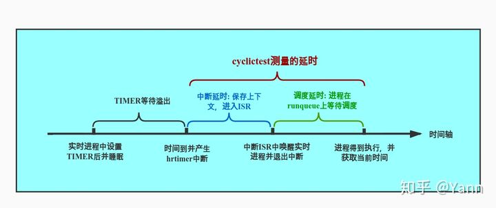

#  概述
cyclictest是rt-tests下的一个高精度的测试程序，也是rt-tests 下使用最广泛的测试工具，一般主要用来测试使用内核的延迟，从而判断内核的实时性。
延迟 主要 体现为 当事件发生时 ，多久获得到逻辑执行的时间
其中 主要会产生 中断延时 调度延时，比如 上下文的切换时间，中断程序的处理时间，进程在队列里等待时间，等一系列，在事件发生到事件响应中发生的一些列用时操作。
cyclictest 就是 用 定时器 来 计算 这些 开销 然后 给出 延时 时间

## 思路
为了测量延迟，Cyclictest 运行一个非实时主线程（调度类 SCHED_OTHER），它以定义的实时优先级启动定义数量的测量线程。测量线程被一个到期的计时器（循环警报）以定义的时间间隔周期性地唤醒。随后，计算出编程唤醒时间和有效唤醒时间之间的差异，并通过共享内存移交给主线程。主线程跟踪延迟值并打印最小、最大和平均延迟。
## 原理

在主线程里准备共享内存，存放对应新线程里的统计信息，然后开启多个计时器线程，计时器线程里循环执行定时器，并对比睡眠时间和规定时间的差值，来统计系统执行调度和切换所花费的延时。
通过启动一个master的普通进程，然后master进程再启动指定数量指定优先级的实时进程，实时进程会设置一个timer周期性的唤醒自己（从timer溢出触发中断并进入ISR调用wake_up_process()唤醒实时进程，到进程真正能被运行，这中间的时间即我们需要测量的延时）。实时进程得到运行后会再次获取当前系统时间，减去睡眠时间时的时间以及睡眠的时间即可得到延时时间，并通过共享内存将该值传递给master进程进行统计，如此周而复始，最终由master进程将结果输出。

# 使用
##  编译
当rt-tests测试套件安装完成后，本程序就被安装在/usr/local/bin目录下。
```
# 编译安装rt-tests测试套件
sudo apt-get install build-essential libnuma-dev    # 安装编译环境和必需的库
git clone git://git.kernel.org/pub/scm/utils/rt-tests/rt-tests.git
cd rt-tests
git checkout stable/v1.0    # master分支不是稳定版，所以要切换到stable分支
make all
make install
```
## 参数

```
-a [CPUSET]	--affinity	如果可能的话，在#N处理器上运行#N线程，或者如果给出了CPUSET，则将线程以轮流的顺序钉在该组处理器上。 例如，-a 2将所有线程钉在CPU 2上，但-a 3-5,0 -t 5将在CPU (0)上运行第一和第五线程，在CPU 3上运行第二线程，在CPU 4上运行第三线程 在CPU 4上，而5号线程在CPU 5上。
-A USEC	--aligned=USEC	将线程唤醒调整到一个特定的偏移量
-b USEC	--breaktrace=USEC	当延时>USEC时，发送中断跟踪命令
-B	--preemptirqs	抢占和关闭irqsoff追踪（与-b一起使用）
-c CLOCK	--clock=CLOCK	选择时钟                             0 = CLOCK_MONOTONIC (默认)                             1 = clock_realtime
-C	--context	上下文切换跟踪（与-b一起使用）
-d	--distance=DIST	线程间隔的距离，单位：us 默认=500
-D	--duration=t	指定一个测试运行的时间长度  默认以秒为单位，但可以添加'm'、'h'或'd'。来修改数值为分钟、小时或天
-E	--event	事件追踪（与-b一起使用）
-f	--ftrace	函数跟踪（当-b被激活时）
-F	--fifo=<path>	在路径处创建一个命名的管道，并向其写入统计信息
-h	--histogram=US	运行后将延迟直方图转储到stdout  (对许多线程具有相同的优先级)  US是被追踪的最大时间，单位是微秒
-H	--histofall=US	与-h相同，只是多了一个摘要栏
-i INTV	--interval=INTV	线程的基本间隔，单位是us 默认=1000
-I	--irqsoff	Irqsoff追踪（与-b一起使用）
-l LOOPS	--loops=LOOPS	循环次数：默认=0（无尽）
-m	--mlockall	锁定当前和未来的内存分配
-M	--refresh_on_max	延迟更新屏幕，直到达到一个新的最大延时
-n	--nanosleep	使用 clock_nanosleep
-N	--nsecs	用ns而不是us来打印结果（默认为us）
-o RED	--oscope=RED	示波器模式下，通过RED来减少冗长的输出
-O TOPT	--traceopt=TOPT	追踪选项
-p PRIO	--prio=PRIO	最高优先级的线程
-P	--preemptoff	抢先关闭跟踪（与-b一起使用）
-q	--quiet	退出时只打印一个摘要
-r	--relative	使用相对定时器而不是绝对定时器
-R	--resolution	检查时钟分辨率，多次调用 clock_gettime() clock_gettime()值的列表将被报告为 用-X报告
-s	--system	使用sys_nanosleep和sys_setitimer
-S	--smp	标准SMP测试：选项-a -t -n和 所有线程的优先级相同
-t	--threads	每个可用的处理器有一个线程
-t NUM	--threads=NUM	线程的数量。                             没有NUM，线程数= max_cpus                             不含-t 默认 = 1
-T TRACE	--tracer=TRACER	设置追踪功能      配置的追踪器：无
-u	--unbuffered	强制为实时处理提供无缓冲的输出
-U	--numa	标准NUMA测试（类似于SMP选项）                             从本地节点分配线程数据结构
-v	--verbose	在stdout上输出统计值                             格式：n:c:v n=tasknum c=count v=value in us
-w	--wakeup	任务唤醒跟踪（与-b一起使用）
-W	--wakeuprt	rt任务唤醒跟踪（与-b一起使用）
	--latency=PM_QOS	写入PM_QOS到/dev/cpu_dma_latency
	--secaligned [USEC]	将线程唤醒调整到下一整秒。                             并应用可选的偏移量
	--dbg_cyclictest	打印对调试cyclictest有用的信息
	--policy=POLI	实时线程的策略，POLI可以是fifo（默认）或rr。                             格式。--policy=fifo(default)或--policy=rr
	--laptop	运行cyclictest时节省电池  			   这将给你带来较差的实时结果  			   但不会那么快耗尽你的电池
	--notrace	抑制追踪--nsecs
	--priospread	从指定值开始传播优先级
	--secaligned [USEC]	将线程唤醒调整到下一整秒。                             并应用可选的偏移量

```
## 例子
最坏情况延迟测试场景[<sup>3</sup>](#refer-anchor-2)

下面的测试代码是 RT 系统中最坏情况的背景压力

```
time cyclictest -t50 -p 80 -i 10000 -n -l 10000000000
```
产生大量 负载的方法
```
stress-ng -c 8 --cpu-method all --sock 8 --tsc 8 -i 8 -d 8 -o 8 -p 8 -s 8 -T 8 -m 8 -t 1m
```
* -c 运行 8 个线程 执行 stress-ng 的内置的所有类型 cpu计算函数
* -- sock 8  开始8个worker执行 socket I/O
* -- tsc 8    开始8个worker执行 读取 tsc
* -i  8 开始8个 worker 执行 io
* -d 8 开始8个 worker 执行 write()/unlink()
* -o 8 开始8个worker执行 open/close
* -m 8 开始8个worker执行 分配和回收mmap
* -p 8 开始 8个多线程 执行 pipe io
* -s 8 开始8个worker快速执行 context switch
* -T 开始8个worker 执行定时器时间
* -t 执行时间

模拟  cpu负载 、io负载、网络 负载、硬盘io负载、
## 数据含义

```
T: 0 (39000) P: 0 I:1000 C:   1805 Min:      2 Act:    6 Avg:    4 Max:      77

T ：0 线程标号
(39000) 线程id
P：0 线程 优先级cyclictest +
C：1850 运行的周期数
I：1000  定时器时间
Min  目前最小延时
Act  最后一次循环的延时
Max 目前最大延时 
```

## 性能指标
* 延时  
不论系统运行在任何代码路径，当事件发生时，系统响应该事件的时间即为延时。
延时在不同的上下文有不同的含义，而cyclictest所测得的延时是中断延时加调度延时，如下图。中断延时(interrupt latency)，即中断发生到进入中断处理程序ISR的延时。调度延时(scheduling latency)，即当任务被唤醒到任务真正获得CPU使用权中间的延时。
借用图片展示如下[<sup>1</sup>](#refer-anchor-1)  

# 实现方法
## 定义
线程参数 结构体
```c
struct thread_param {
	int prio;	// 线程的优先级
	int policy;	// 线程的调度算法
	int mode;	// mode=use_nanosleep+use_system;
    		// MODE_CYCLIC : 0, 使用进程自己的计时器，通过信号等待。0+0
    		// MODE_SYS_ITIMER : 2, 使用系统的计时器，通过信号等待。0+2
    		// MODE_CLOCK_NANOSLEEP : 1,使用进程的计时器，通过睡眠等待。1+0
    		// MODE_SYS_NANOSLEEP : 3,使用系统的计时器，通过睡眠等待。1+2
    		// MODE_SYS_OFFSET : 2,表示这个位移是关于系统时钟的。仅用于计算，不作为mode可取的值。
	int timermode;	// 计时器的模式。
    		// TIMER_ABSTIME : 计时器在一个绝对时间到期
    		// TIMER_RELTIME : 0, 计时器在一个时间间隔到期
	int signal;	// 当计时器超时的时候给当前线程发的信号。主线程把它设置为SIGALRM
	int clock;	// 当前线程所用的时钟类型。
    		// CLOCK_MONOTONIC - 记录单调时间的时钟，即系统启动到现在的秒数。
    		// CLOCK_REALTIME - 系统范围的时钟，用于测量真实时间。
	unsigned long max_cycles;	// 用户设置的循环次数，等于全局变量max_cycles的值。
	struct thread_stat *stats;
	int bufmsk;	// 缓冲区stat->values和stat->smis的掩码，即二进制全为1的数。
	unsigned long interval;
	int cpu;	// 与亲和性关联的cpu编号。-1，无亲和性。其它整数，线程与此cpu有亲和性。
	int node;	// numa结点。-1表示不使用numa结点。
	int tnum;	// 线程的编号。创建线程用的for循环，即for循环的次数，从0开始。
	int msr_fd;	// msi相关
};
```

线程统计 结构体
```c
struct thread_stat {
	unsigned long cycles;	// 记录线程执行了多少次计时循环
	unsigned long cyclesread;
	long min;		// 线程等待的最小值。单位：微秒。
	long max;		// 线程等待的最大值。单位：微秒。
	long act;		// 线程等待的实际值。单位：微秒。
	double avg;		// 线程等待的平均值。单位：微秒。
	long *values;	// 一个缓冲区，用于记录当前线程所有diff的值。
	long *smis;		// 一个缓冲区，用于记录当前线程所有diff_smi的值。
	long *hist_array;	// 代表时延直方图的数组。数组的元素数即为用户设置的全局变量histogram的值。
	long *outliers;	// 一个数组，记录了时延直方图溢出时stat->cycles的值
	pthread_t thread;
	int threadstarted;	// 线程是否启动的标志。-1已关闭，>0已启动。
	int tid;		// 内核里的线程id
	long reduce;
	long redmax;
	long cycleofmax;
	long hist_overflow;	// 溢出时延直方图的时延的数量
	long num_outliers;	// 数组stat->outliers的下标，它的意思里这个数组里记录了多少个元素。
	unsigned long smi_count;	// 系统管理中断的次数
};
```
## 方法
计时器线程
```
void *timerthread(void *param)
```
通过 clock_gettime 和 clock_nanosleep 来 计算内核切换和调度所造成的延时多少
## syscall

### clock_gettime
```C
#include<time.h>
int clock_gettime(clockid_t clockid , struct timespec *tp);
int clock_gettrs(clockid_t clockid, struct timespec *res);
```
返回的时间值置于 tp 指针所指向的 timespec 结构中。虽然 timespec 结构提供了纳秒级精度，但 clock_gettime()返回的时间值粒度可能还是要更大一点。系统调用 clock_getres()在参数 res中返回指向 timespec 结构的指针，结构中包含了由 clockid 所指定时钟的分辨率。clockid_t 是一种由 SUSv3 定义的数据类型，用于表示时钟标识符。

clock id 类型
1. CLOCK_REALTIME 可设定的系统级实时时钟
2. CLOCK_MONOTONIC 不可设定的恒定态时钟
3. CLOCK_PROCESS_CPUTIME_ID 每进程 CPU 时间的时钟
4. CLOCK_THREAD_CPUTIME_ID 每线程 CPU 时间的时钟

CLOCK_REALTIME 时钟是一种系统级时钟，用于度量真实时间。与 CLOCK_MONOTONIC 时钟不同，它的设置是可以变更的。

SUSv3 规定，CLOCK_MONOTONIC 时钟对时间的度量始于“未予规范的过去某一时点”，系统启动后就不会发生改变。该时钟适用于那些无法容忍系统时钟发生跳跃性变化（例如：手工改变了系统时间）的应用程序。Linux 上，这种时钟对时间的测量始于系统启动。

CLOCK_PROCESS_CPUTIME_ID 时钟测量调用进程所消耗的用户和系统 CPU 时间。CLOCK_THREAD_CPUTIME_ID 时钟的功用与之相类似，不过测量对象是进程中的单条线程。

SUSv3 规范了表 23-1 中的所有时钟，但强制要求实现的仅有 CLOCK_REALTIME 一种，
这同时也是受到 UNIX 实现广泛支持的时钟类型。


### nanosleep

函数 nanosleep()的功用与 sleep()类似，但更具优势，其中包括能以更高分辨率来设定休眠
间隔时间
```C
#include<time.h>
int nanosleep(const struct timespec *request, struct timespec *remain);
```
参数 request 指定了休眠的持续时间，是一个指向如下结构的指针
```C
struct timespec {
	time_t tv_sec;  // 秒
	long   tv_nsec; // 纳秒
}
```
tv_nsec 字段为纳秒值，取值范围在 0～999999999 之间。

nanosleep()的更大优势在于，SUSv3 明文规定不得使用信号来实现该函数。这意味着，与sleep()不同，即使将 nanosleep()与 alarm()或 setitimer()混用，也不会危及程序的可移植性

### clock_nanosleep
```C
#include<time.h>
int clock_nanosleep(clockid_t clockid . int flags, const struct timespec *request, struct timespec * remain);
```
参数 request 及 remain 同 nanosleep()中的对应参数目的相似。
默认情况下（即 flags 为 0），由 request 指定的休眠间隔时间是相对时间（类似于 nanosleep()）。

不过，如果在 flags 中设定了 TIMER_ABSTIME，request 则表示 clockid 时钟所测量的绝对时间。这一特性对于那些需要精确休眠一段指定时间的应用程序至关重要。

如果只是先获取当前时间，计算与目标时间的差距，再以相对时间进行休眠，进程可能执行到一半就被占先了 ，结果休眠时间比预期的要久。

对于那些被信号处理器函数中断并使用循环重启休眠的进程来说，
“嗜睡（oversleeping）”问题尤其明显。如果以高频率接收信号，那么按相对时间休眠（nanosleep()
所执行的类型）的进程在休眠时间上会有较大误差。但可以通过如下方式来避免嗜睡问题：

先调用 clock_gettime()获取时间，加上期望休眠的时间量，再以 TIMER_ABSTIME 标志调用
clock_nanosleep()函数（并且，如果被信号处理器中断，则会重启系统调用）。

指定 TIMER_ABSTIME 时，不再（且不需要）使用参数 remain。如果信号处理器程序中断
了 clock_nanosleep()调用，再次调用该函数来重启休眠时，request 参数不变。

将 clock_nanosleep()与 nanosleep()区分开来的另一特性在于，可以选择不同的时钟来测量休
眠间隔时间。可在 clockid 中指定所期望的时钟 CLOCK_REALTIME、CLOCK_ MONOTONIC
或 CLOCK_PROCESS_CPUTIME_ID

# 实现分析

## 流程图


## 代码

__主线程__

从 main 函数入口，分析其主要运行逻辑
int main(int argc, char **argv)
```C
{
	// 0. 声明变量
	sigset_t sigset;
	int signum = SIGALRM;
	int mode;
	int status;

	// 1. 处理 进程 配置选项
	process_options(argc, argv, max_cpus);
	
	...
	// 设置信号阻塞SIGALRM
	sigemptyset(&sigset);
	sigaddset(&sigset, signum);
	sigprocmask (SIG_BLOCK, &sigset, NULL);
	// 当以下信号发生，调用sighand
	signal(SIGINT, sighand);
	signal(SIGTERM, sighand);
	signal(SIGUSR1, sighand);

	// 进程 参数 数组
	parameters = calloc(num_threads, sizeof(struct thread_param *));
	if (!parameters)
		goto out;
	statistics = calloc(num_threads, sizeof(struct thread_stat *));
	if (!statistics)
		goto outpar;

	...

}
```
main 函数 一开始 声明 一些 后续要使用到的一些变量，然后根据进程传入的参数 开始 配置 需要使用的功能，为后续准备工作。
设置信号集 是 阻塞sigalrm打断此线程，并对SIGINT,SIGTEM和SIGUSR 信号触发后，调用 sighand 函数代替默认函数。
最后对parameters 和 statistics 分配空间，根据线程数分配对应个数空间大小。

1. `process_options()`处理参数。

2. `check_privs()`检查当前进程调度算法是否是实时的，或可切换为实时的。

3. 如设置了`trigger`，则调用`trigger_init()`初始化单向链表`head`。

   1. 此链表的元素为`struct thread_trigger`。

      ```c
      /* Info to store when the diff is greater than the trigger */
      struct thread_trigger {
      	int cpu;
      	int tnum;	/* 线程的编号 */
      	int64_t  ts;	/* time-stamp */
      	int diff;
      	struct thread_trigger *next;	// 下一个元素的指针
      };
      ```

   2. 此链表第一个元素的指针为head，最后一个元素的指针为tail。

   3. current用来指向链表上需要被更新的元素。

   4. 此链表增加元素采用后插法。

4. 如设置了`lockall`，则调用`mlockall(MCL_CURRENT|MCL_FUTURE)`。

5. 调用`set_latency_target()`设置电源管理系统，这是为了降低时延。

   1. `/dev/cpu_dma_latency`要存在。
   2. 把0写入文件`/dev/cpu_dma_latency`。效果为告诉电源管理系统不要切换到高cstate。当文件关闭后，电源管理器的行为将切换回系统默认的状态。目的是为了阻止CPU进入低功耗状态。详见`Documentation/power/pm_qos_interface.txt`。

6. 调用`check_kernel()`检查内核信息。

   1. 使用`uname()`获取内核信息，保存在`struct utsname kname`。
   2. 把`kname.release`的信息分别保存在`maj`, `min`, `sub`里。
   3. 使用上步三个变量控制`kv`、`functiontracer`、`traceroptions`的值。
   4. 返回`kv`的值。

7. 调用`setup_tracer()`来设置tracer。

   1. 执行`debugfs_prepare()`设置fileprefix，即debugfs的目录名。
   2. 由于现代内核都大于2.6.28，故只看if分支的代码。
   3. 如果debugfs里tracing_enabled文件存在且tracing_on文件不存在，则向tracing_enabled文件里写入1。
   4. 如果设置了tracetype，则向ftrace_enabled写入1，否则写入0。
   5. 使用`settracer("nop")`把"nop"写入current_tracer文件。
   6. 在一个switch分支里依据tracetype的值，把相应的tracer写入current_tracer文件。
   7. 如设置了enable_events，则调用`event_enable_all()`把1写入debugfs里的events/enable文件。
   8. 向traceroptions文件里写入一些tracer。
   9. 如设置了traceopt_count，则向traceroptions文件写入traceptr数组里的指针元素。
   10. 向tracing_max_latency文件里写入0。
   11. 如latency_hist目录存在，则向latency_hist/wakeup/reset文件写入1。
   12. 如trace_fd==-1，则给trace_fd赋值，如tracing_on存在它对应的文件就是tracing_on，否则它对应的文件是tracing_enable。
   13. 调用`opentracemark_fd()`给tracemark_fd赋值。
   14. 跳过else分支不进行分析，因为现代内核一定大于2.6.28。
   15. 调用`tracing(1)`向trace_fd里写入1。

8. 调用`enable_trace_mark()`打开debugfs下的文件trace_marker。

   1. 执行`debugfs_prepare()`挂载debugfs并把它的路径名赋值给fileprefix。
   2. 执行`open_tracemark_fd()`打开debugfs下的文件trace_marker。

9. 执行`check_timer()`检查时钟的精度。

10. 如果设置了check_clock_resolution则开始检查时钟的精度。目的是看报告时钟精度不能高于测量时钟精度。

    1. 获取时钟精度，将reported_resolution设置为ns表示的精度。
    2. 计算1ms可以调用clock_gettime()多少次，将这个结果保存在times里，如少于1000次按1000次算，如大于100000次按100000次算。
    3. time是一个以`struct timespec`为元素的数组，数组大小为times，调用clock_gettime()在一个for循环里把time数组填满。
    4. 在一个for循环里，用min_non_zero_diff记录下数组time里相邻元素之间的最小差值(这个最小差值不能为0)。这个值即为测量到的时钟精度。
    5. 测量时钟精度不能高于报告时钟精度，否则需输出warn信息。

11. 设置mode，如选项里有-n则use_nanosleep=0B01，如选项里有-s则use_system=0B10。

12. 把信号SIGALRM加到信号屏蔽字上。

13. 调用signal()让sighand()处理信号SIGINT, SIGTERM, SIGUSR1。

    1. 如信号是SIGUSR1，则向stderr输出错误信号，然后返回。
    2. 如是其它两个信号，则shutdown置1。
    3. 如定义了refresh_on_max，则唤醒一个等待在PTHREAD_COND_INITIALIZER上的线程。
    4. 如定义了tracelimit，则向trace_fd文件写入"0"。

14. 为两个关键的数组分配内存。数组parameters包含了每个线程的参数，数组statistics包含了每个线程的统计信息。

```C
...
// 循环开启新线程
for (i = 0; i < num_threads; i++) {
		
		...

		// 声明变量
		struct thread_param *par;
		struct thread_stat *stat;
		
		...
	
		// 分配 线程 参数 块 大小 空间  （默认）
		parameters[i] = par = threadalloc(sizeof(struct thread_param), node);
		if (par == NULL)
			fatal("error allocating thread_param struct for thread %d\\n", i);
		memset(par, 0, sizeof(struct thread_param));

		/* allocate the thread's statistics block */
		// 分配 线程 统计 块 大小 空间
		statistics[i] = stat = threadalloc(sizeof(struct thread_stat), node);
		if (stat == NULL)
			fatal("error allocating thread status struct for thread %d\\n", i);
		memset(stat, 0, sizeof(struct thread_stat));

		...  // 配置传入线程的参数
		
		// 启动新线程
		status = pthread_create(&stat->thread, &attr, timerthread, par);
		if (status)
			fatal("failed to create thread %d: %s\\n", i, strerror(status));
}
...
```
接下来进入 根据 线程个数 开启新线程，先对其线程参数和统计值佛声明和初始化，并使之指向共享内存。
开启新线程，并指定 timerthread 函数 作为 入口点

1. 使用pthread_attr_init()初始化attr。
2. 依据setaffinity的值设置cpu的值。
3. 一般不会编译numa参数，忽略if分支。
4. 为parameters[i]分配内存并将内存初始化为0。
5. 为statistics[i]分配内存并将内存初始化为0。
6. 如设置了histogram，则为statistics[i]里关于直方图的字段分配内存并初始化为0。
7. 如设置了verbose，则为`statistics[i]->value`分配内存，并设置好它的掩码`par->bufmsk`。
8. 初始化parameters[i]和statistics[i]的相关字段。一般来说，都是根据用户的输入直接赋值。但要注意的是，如果没有设置histogram，每个线程par->interval的值会相差distance。
9. 使用pthread_create()创建线程，线程代码为timerthread，线程参数为parameters[i]。

```C
// 统计线程 
	while (!shutdown) {
		// 主要负责 打印 开启的线程的统计信息
		...
		for (i = 0; i < num_threads; i++) {
			// 打印 统计信息
			print_stat(stdout, parameters[i], i, verbose, quiet);
			if(max_cycles && statistics[i]->cycles >= max_cycles)
				allstopped++;
		}
		...
	}
```
在主线程内 负责 打印刚才 开启的 线程的统计信息，通过 刚才的共享内存，统计信息存储在 parameters，statistics。

1. 执行policyname()，读取整型的policy，返回对应的字符串到policystr。
2. 如设置了force_sched_other，则slash="/"、policystr2="other"，否则slash和policystr2都是空串
3. 如果verbose和quiet都没设置，则打印policy和loadavg的值。
4. 在一个for循环里打印每个线程的状态，如线程的循环次数达到了用户设定的次数，则allstopped++
5. 调用usleep()睡眠10000ms，即10s。
6. 如设置了shutdown或allstopped，则退出此循环。
7. 如设置了refresh_on_max，则执行pthread_cond_wait()睡眠，等待子线程通过`pthread_cond_signal()`唤醒自己。

__计时器线程__
在while循环中先睡眠interval微秒，醒来后获取当前时间，计算延时，然后周而复始。伪代码如下：

```C
void *timerthread(void *param)
{

	/* 获得当前时间 */
	clock_gettime(par->clock, &now);
	// 计算 下次 时间 now + 间隔时间
	next = now;
	next.tv_sec += interval.tv_sec;
	next.tv_nsec += interval.tv_nsec;
	tsnorm(&next);

	while (!shutdown) {
		// 睡到 next
		clock_nanosleep(par->clock, TIMER_ABSTIME, &next, NULL))) 
		// 获取 当前时间
		clock_gettime(par->clock, &now)
		// 计算 diff
		diff = calcdiff_ns(now, next);
		// 更新 统计信息
		if (diff < stat->min)
			stat->min = diff;
		if (diff > stat->max) {
			stat->max = diff;
		// 更新 next
		while (tsgreater(&now, &next)) {
			next.tv_sec += interval.tv_sec;
			next.tv_nsec += interval.tv_nsec;
			tsnorm(&next);
		}
		// 退出
		if (par->max_cycles && par->max_cycles == stat->cycles)
			break;
	}
	// ...
}
```

1. 如果par->node==-1，则不进行numa相关的设置。

2. 如par->cpu==-1，则用户没有设置亲和性，直接跳过if分支；否则，通过`pthread_setaffinity_np()`设置当前线程的亲和性。

3. 把`par->interval`写入到`interval`。

4. 通过`gettid()`设置`stat->tid`。

5. 把`par->signal`添加进当前线程的信号屏蔽字。

6. 如果`par->mode==MODE_CYCLIC`，则创建一个计时器，当计时器超时的时候会向当前线程发信号`par->signal`。并将interval记录在`tspec.it_interval`。

   ```c
   /* POSIX.1b structure for timer start values and intervals.  */
   struct itimerspec  {
   	struct timespec it_interval;
   	struct timespec it_value;
   } tspec;
   ```

7. 使用setscheduler()设置当前线程的调度算法和优先级。

8. 暂忽略设置smi后要执行的if分支。

9. 如果设置了aligned或secaligned，即线程唤醒的时候在时间上对齐，则执行if分支。

   1. 调用`pthread_barrier_wait()`让所有线程都到达`globalt_barr`再执行。
   2. 在`globalt_barr`和`align_barr`两个内存屏障之间：如果线程编号为0，即`par->tnum==0`，则调用`clock_gettime()`把`par->clock`的时间记录在`globalt`里。更进一步地，如果设置的是`secaligned==1`，则意味着要按秒对齐，则需进一步调整`blobalt`。
   3. 调用`pthread_barrier_wait()`让所有线程都到达`align_barr`再执行。
   4. 所有线程都把0号线程记录下的`globalt`时间记录在变量`now`中。
   5. 如果设置了offset，则须把offset的时间加到now上。

10. 如果即没有设置aligned，也没有设置secaligned，则走else分支，调用`clock_gettime()`把`par->clock`的时间记录到`now`里。

11. 用`next`记录`now + interval`的时间。它代表了线程下次过期的绝对时间。

12. 如果设置了`duration`，则用`stop`记录`now + duration`的时间。

13. 如果`par->mode == MODE_CYCLIC`，则用`timer_settime()`启动进程的计时器。

14. 如果`par->mode == MODE_SYS_ITIMER`，则用`setitimer()`启动系统的计时器。

15. 执行`stat->threadstarted++`表示线程已启动。

16. 当`shutdown`还没有置1的时候，不停进行while循环：

    1. 依据par->mode的值，设置等待的方式。MODE_CYCLIC和MODE_SYS_ITIMER是通过信号等；MODE_CLOCK_NANOSLEEP是进程计时器，通过睡眠等；MODE_SYS_NANOSLEEP是系统计时器，通过睡眠等。
    1. 调用`clock_gettime()`让`now`记录时间。
    1. 如设置了`smi`，则用`stat->smi_count`记录系统管理中断的次数。
    1. 用`diff`记录`now - next`的值。
    1. 分别用`stat->min`和`stat->max`记录`diff`的最小值和最大值。如产生了新的最大值且设置了`refresh_on_max`，则执行`pthread_cond_signal()`唤醒睡眠中的主线程。
    1. 用`stat->avg`记录`diff`的累加和。
    1. 如设置了trigger且`diff > trigger`，则执行`trigger_update()`给结构体`current`的相关字段赋值，`current`会自己转移到链表里的下个元素。
    1. 如果用户设置了程序运行时间duration，且已经达到了用户指定的时间now - stop >= 0，则shutdown++，意为可以关闭程序了。
    1. `stopped`变量是线程是否停止的标志，0表示没有停止，1表示停止。当线程没有停止的时候，如果用户设置了追踪的限制时间tracelimit且diff > tracelimit，则表示进程应在当前线程停止，则会标记相关的变量和文件。
    1. 用`stat->act`记录当前`diff`的值。
    1. 如用户分配了缓冲区`stat->values`或`stat->smis`，则它们的掩码`par->bufmsk`非0，此会把每个diff都记录到缓冲区里。如果diff的数量超过缓冲区的大小，则会覆盖之前的记录。
    1. 如设置了`histogram`，则向代表直方图的数组里记录相应的数据。
    1. `stat->cycles++;`
    1. next += interval；如果是在MODE_CYCLIC模式，可能因为信号或线程而溢出了多次，这些也都需要一并计算进去。
    1. 如果now > next，则next += interval。
    1. 如果用户设置了循环次数par->max_cycles，且当前线程执行了这么多次的循环，则退出当前的while循环。

17. out标志，用于释放相关的资源。

# 引用

<div id="refer-anchor-1"></div>  

- [1] [cyclictest知乎](https://zhuanlan.zhihu.com/p/336381111)


<div id="refer-anchor-2"></div>  

- [2] [互斥量](https://blog.csdn.net/qq_39736982/article/details/82348672)

<div id="refer-anchor-3"></div>  

- [3] [cyclictest wiki](https://wiki.linuxfoundation.org/realtime/documentation/howto/tools/cyclictest/start)

