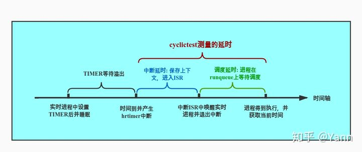
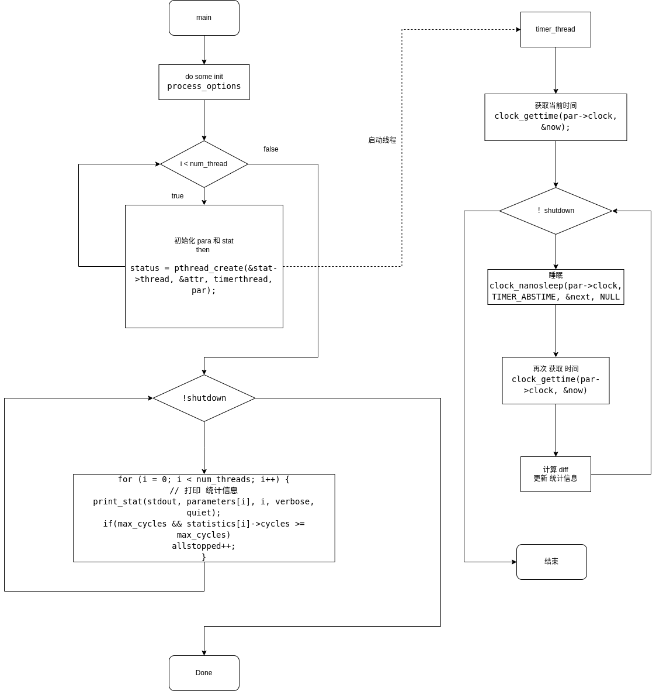

# ptsematest 文档
#  概述
cyclictest是rt-tests下的一个高精度的测试程序，也是rt-tests 下使用最广泛的测试工具，一般主要用来测试使用内核的延迟，从而判断内核的实时性。
延迟 主要 体现为 当事件发生时 ，多久获得到逻辑执行的时间
其中 主要会产生 中断延时 调度延时，比如 上下文的切换时间，中断程序的处理时间，进程在队列里等待时间，等一系列，在事件发生到事件响应中发生的一些列用时操作。
cyclictest 就是 用 定时器 来 计算 这些 开销 然后 给出 延时 时间

## 思路
为了测量延迟，Cyclictest 运行一个非实时主线程（调度类 SCHED_OTHER），它以定义的实时优先级启动定义数量的测量线程。测量线程被一个到期的计时器（循环警报）以定义的时间间隔周期性地唤醒。随后，计算出编程唤醒时间和有效唤醒时间之间的差异，并通过共享内存移交给主线程。主线程跟踪延迟值并打印最小、最大和平均延迟。
## 原理

在主线程里准备共享内存，存放对应新线程里的统计信息，然后开启多个计时器线程，计时器线程里循环执行定时器，并对比睡眠时间和规定时间的差值，来统计系统执行调度和切换所花费的延时。
通过启动一个master的普通进程，然后master进程再启动指定数量指定优先级的实时进程，实时进程会设置一个timer周期性的唤醒自己（从timer溢出触发中断并进入ISR调用wake_up_process()唤醒实时进程，到进程真正能被运行，这中间的时间即我们需要测量的延时）。实时进程得到运行后会再次获取当前系统时间，减去睡眠时间时的时间以及睡眠的时间即可得到延时时间，并通过共享内存将该值传递给master进程进行统计，如此周而复始，最终由master进程将结果输出。

# 使用
##  编译
当rt-tests测试套件安装完成后，本程序就被安装在/usr/local/bin目录下。
```
# 编译安装rt-tests测试套件
sudo apt-get install build-essential libnuma-dev    # 安装编译环境和必需的库
git clone git://git.kernel.org/pub/scm/utils/rt-tests/rt-tests.git
cd rt-tests
git checkout stable/v1.0    # master分支不是稳定版，所以要切换到stable分支
make all
make install
```
## 参数

```
-a [CPUSET]	--affinity	如果可能的话，在#N处理器上运行#N线程，或者如果给出了CPUSET，则将线程以轮流的顺序钉在该组处理器上。 例如，-a 2将所有线程钉在CPU 2上，但-a 3-5,0 -t 5将在CPU (0)上运行第一和第五线程，在CPU 3上运行第二线程，在CPU 4上运行第三线程 在CPU 4上，而5号线程在CPU 5上。
-A USEC	--aligned=USEC	将线程唤醒调整到一个特定的偏移量
-b USEC	--breaktrace=USEC	当延时>USEC时，发送中断跟踪命令
-B	--preemptirqs	抢占和关闭irqsoff追踪（与-b一起使用）
-c CLOCK	--clock=CLOCK	选择时钟                             0 = CLOCK_MONOTONIC (默认)                             1 = clock_realtime
-C	--context	上下文切换跟踪（与-b一起使用）
-d	--distance=DIST	线程间隔的距离，单位：us 默认=500
-D	--duration=t	指定一个测试运行的时间长度  默认以秒为单位，但可以添加'm'、'h'或'd'。来修改数值为分钟、小时或天
-E	--event	事件追踪（与-b一起使用）
-f	--ftrace	函数跟踪（当-b被激活时）
-F	--fifo=<path>	在路径处创建一个命名的管道，并向其写入统计信息
-h	--histogram=US	运行后将延迟直方图转储到stdout  (对许多线程具有相同的优先级)  US是被追踪的最大时间，单位是微秒
-H	--histofall=US	与-h相同，只是多了一个摘要栏
-i INTV	--interval=INTV	线程的基本间隔，单位是us 默认=1000
-I	--irqsoff	Irqsoff追踪（与-b一起使用）
-I LOOPS	--loops=LOOPS	循环次数：默认=0（无尽）
-m	--mlockall	锁定当前和未来的内存分配
-M	--refresh_on_max	延迟更新屏幕，直到达到一个新的最大延时
-n	--nanosleep	使用 clock_nanosleep
-N	--nsecs	用ns而不是us来打印结果（默认为us）
-o RED	--oscope=RED	示波器模式下，通过RED来减少冗长的输出
-O TOPT	--traceopt=TOPT	追踪选项
-p PRIO	--prio=PRIO	最高优先级的线程
-P	--preemptoff	抢先关闭跟踪（与-b一起使用）
-q	--quiet	退出时只打印一个摘要
-r	--relative	使用相对定时器而不是绝对定时器
-R	--resolution	检查时钟分辨率，多次调用 clock_gettime() clock_gettime()值的列表将被报告为 用-X报告
-s	--system	使用sys_nanosleep和sys_setitimer
-S	--smp	标准SMP测试：选项-a -t -n和 所有线程的优先级相同
-t	--threads	每个可用的处理器有一个线程
-t NUM	--threads=NUM	线程的数量。                             没有NUM，线程数= max_cpus                             不含-t 默认 = 1
-T TRACE	--tracer=TRACER	设置追踪功能      配置的追踪器：无
-u	--unbuffered	强制为实时处理提供无缓冲的输出
-U	--numa	标准NUMA测试（类似于SMP选项）                             从本地节点分配线程数据结构
-v	--verbose	在stdout上输出统计值                             格式：n:c:v n=tasknum c=count v=value in us
-w	--wakeup	任务唤醒跟踪（与-b一起使用）
-W	--wakeuprt	rt任务唤醒跟踪（与-b一起使用）
	--latency=PM_QOS	写入PM_QOS到/dev/cpu_dma_latency
	--secaligned [USEC]	将线程唤醒调整到下一整秒。                             并应用可选的偏移量
	--dbg_cyclictest	打印对调试cyclictest有用的信息
	--policy=POLI	实时线程的策略，POLI可以是fifo（默认）或rr。                             格式。--policy=fifo(default)或--policy=rr
	--laptop	运行cyclictest时节省电池  			   这将给你带来较差的实时结果  			   但不会那么快耗尽你的电池
	--notrace	抑制追踪--nsecs
	--priospread	从指定值开始传播优先级
	--secaligned [USEC]	将线程唤醒调整到下一整秒。                             并应用可选的偏移量

```
## 例子
最坏情况延迟测试场景[<sup>3</sup>](#refer-anchor-2)

下面的测试代码是 RT 系统中最坏情况的背景压力

```
time cyclictest -t50 -p 80 -i 10000 -n -l 10000000000
```
产生大量 负载的方法
```
stress-ng -c 8 --cpu-method all --sock 8 --tsc 8 -i 8 -d 8 -o 8 -p 8 -s 8 -T 8 -m 8 -t 1m
```
* -c 运行 8 个线程 执行 stress-ng 的内置的所有类型 cpu计算函数
* -- sock 8  开始8个worker执行 socket I/O
* -- tsc 8    开始8个worker执行 读取 tsc
* -i  8 开始8个 worker 执行 io
* -d 8 开始8个 worker 执行 write()/unlink()
* -o 8 开始8个worker执行 open/close
* -m 8 开始8个worker执行 分配和回收mmap
* -p 8 开始 8个多线程 执行 pipe io
* -s 8 开始8个worker快速执行 context switch
* -T 开始8个worker 执行定时器时间
* -t 执行时间

模拟  cpu负载 、io负载、网络 负载、硬盘io负载、
## 数据含义

```
T: 0 (39000) P: 0 I:1000 C:   1805 Min:      2 Act:    6 Avg:    4 Max:      77

T ：0 线程标号
(39000) 线程id
P：0 线程 优先级cyclictest +
C：1850 运行的周期数
I：1000  定时器时间
Min  目前最小延时
Act  最后一次循环的延时
Max 目前最大延时 
```

## 性能指标
* 延时  
不论系统运行在任何代码路径，当事件发生时，系统响应该事件的时间即为延时。
延时在不同的上下文有不同的含义，而cyclictest所测得的延时是中断延时加调度延时，如下图。中断延时(interrupt latency)，即中断发生到进入中断处理程序ISR的延时。调度延时(scheduling latency)，即当任务被唤醒到任务真正获得CPU使用权中间的延时。
借用图片展示如下[<sup>1</sup>](#refer-anchor-1)  

# 实现方法
## 定义
线程参数 结构体
```
struct thread_param {
	int prio;
	int policy;
	int mode;
	int timermode;
	int signal;
	int clock;
	unsigned long max_cycles;
	struct thread_stat *stats;
	int bufmsk;
	unsigned long interval;
	int cpu;
	int node;
	int tnum;
};
```

线程统计 结构体
```
struct thread_stat {
	unsigned long cycles;
	unsigned long cyclesread;
	long min;
	long max;
	long act;
	double avg;
	long *values;
	long *hist_array;
	long *outliers;
	pthread_t thread;
	int threadstarted;
	int tid;
	long reduce;
	long redmax;
	long cycleofmax;
	long hist_overflow;
	long num_outliers;
};
```
## 方法
计时器线程
```
void *timerthread(void *param)
```
通过 clock_gettime 和 clock_nanosleep 来 计算内核切换和调度所造成的延时多少
## syscall

### clock_gettime
```C
#include<time.h>
int clock_gettime(clockid_t clockid , struct timespec *tp);
int clock_gettrs(clockid_t clockid, struct timespec *res);
```
返回的时间值置于 tp 指针所指向的 timespec 结构中。虽然 timespec 结构提供了纳秒级精度，但 clock_gettime()返回的时间值粒度可能还是要更大一点。系统调用 clock_getres()在参数 res中返回指向 timespec 结构的指针，结构中包含了由 clockid 所指定时钟的分辨率。clockid_t 是一种由 SUSv3 定义的数据类型，用于表示时钟标识符。

clock id 类型
1. CLOCK_REALTIME 可设定的系统级实时时钟
2. CLOCK_MONOTONIC 不可设定的恒定态时钟
3. CLOCK_PROCESS_CPUTIME_ID 每进程 CPU 时间的时钟
4. CLOCK_THREAD_CPUTIME_ID 每线程 CPU 时间的时钟

CLOCK_REALTIME 时钟是一种系统级时钟，用于度量真实时间。与 CLOCK_MONOTONIC 时钟不同，它的设置是可以变更的。

SUSv3 规定，CLOCK_MONOTONIC 时钟对时间的度量始于“未予规范的过去某一时点”，系统启动后就不会发生改变。该时钟适用于那些无法容忍系统时钟发生跳跃性变化（例如：手工改变了系统时间）的应用程序。Linux 上，这种时钟对时间的测量始于系统启动。

CLOCK_PROCESS_CPUTIME_ID 时钟测量调用进程所消耗的用户和系统 CPU 时间。CLOCK_THREAD_CPUTIME_ID 时钟的功用与之相类似，不过测量对象是进程中的单条线程。

SUSv3 规范了表 23-1 中的所有时钟，但强制要求实现的仅有 CLOCK_REALTIME 一种，
这同时也是受到 UNIX 实现广泛支持的时钟类型。


### nanosleep

函数 nanosleep()的功用与 sleep()类似，但更具优势，其中包括能以更高分辨率来设定休眠
间隔时间
```C
#include<time.h>
int nanosleep(const struct timespec *request, struct timespec *remain);
```
参数 request 指定了休眠的持续时间，是一个指向如下结构的指针
```C
struct timespec {
	time_t tv_sec;  // 秒
	long   tv_nsec; // 纳秒
}
```
tv_nsec 字段为纳秒值，取值范围在 0～999999999 之间。

nanosleep()的更大优势在于，SUSv3 明文规定不得使用信号来实现该函数。这意味着，与sleep()不同，即使将 nanosleep()与 alarm()或 setitimer()混用，也不会危及程序的可移植性

### clock_nanosleep
```C
#include<time.h>
int clock_nanosleep(clockid_t clockid . int flags, const struct timespec *request, struct timespec * remain);
```
参数 request 及 remain 同 nanosleep()中的对应参数目的相似。
默认情况下（即 flags 为 0），由 request 指定的休眠间隔时间是相对时间（类似于 nanosleep()）。

不过，如果在 flags 中设定了 TIMER_ABSTIME，request 则表示 clockid 时钟所测量的绝对时间。这一特性对于那些需要精确休眠一段指定时间的应用程序至关重要。

如果只是先获取当前时间，计算与目标时间的差距，再以相对时间进行休眠，进程可能执行到一半就被占先了 ，结果休眠时间比预期的要久。

对于那些被信号处理器函数中断并使用循环重启休眠的进程来说，
“嗜睡（oversleeping）”问题尤其明显。如果以高频率接收信号，那么按相对时间休眠（nanosleep()
所执行的类型）的进程在休眠时间上会有较大误差。但可以通过如下方式来避免嗜睡问题：

先调用 clock_gettime()获取时间，加上期望休眠的时间量，再以 TIMER_ABSTIME 标志调用
clock_nanosleep()函数（并且，如果被信号处理器中断，则会重启系统调用）。

指定 TIMER_ABSTIME 时，不再（且不需要）使用参数 remain。如果信号处理器程序中断
了 clock_nanosleep()调用，再次调用该函数来重启休眠时，request 参数不变。

将 clock_nanosleep()与 nanosleep()区分开来的另一特性在于，可以选择不同的时钟来测量休
眠间隔时间。可在 clockid 中指定所期望的时钟 CLOCK_REALTIME、CLOCK_ MONOTONIC
或 CLOCK_PROCESS_CPUTIME_ID

# 实现分析

## 流程图



## 代码

__主线程__

从 main 函数入口，分析其主要运行逻辑
int main(int argc, char **argv)
```C
{
	// 0. 声明变量
	sigset_t sigset;
	int signum = SIGALRM;
	int mode;
	int status;

	// 1. 处理 进程 配置选项
	process_options(argc, argv, max_cpus);
	
	...
	// 设置信号阻塞SIGALRM
	sigemptyset(&sigset);
	sigaddset(&sigset, signum);
	sigprocmask (SIG_BLOCK, &sigset, NULL);
	// 当以下信号发生，调用sighand
	signal(SIGINT, sighand);
	signal(SIGTERM, sighand);
	signal(SIGUSR1, sighand);

	// 进程 参数 数组
	parameters = calloc(num_threads, sizeof(struct thread_param *));
	if (!parameters)
		goto out;
	statistics = calloc(num_threads, sizeof(struct thread_stat *));
	if (!statistics)
		goto outpar;

	...

}
```
main 函数 一开始 声明 一些 后续要使用到的一些变量，然后根据进程传入的参数 开始 配置 需要使用的功能，为后续准备工作。
设置信号集 是 阻塞sigalrm打断此线程，并对SIGINT,SIGTEM和SIGUSR 信号触发后，调用 sighand 函数代替默认函数。
最后对parameters 和 statistics 分配空间，根据线程数分配对应个数空间大小。
```C
...
// 循环开启新线程
for (i = 0; i < num_threads; i++) {
		
		...

		// 声明变量
		struct thread_param *par;
		struct thread_stat *stat;
		
		...
	
		// 分配 线程 参数 块 大小 空间  （默认）
		parameters[i] = par = threadalloc(sizeof(struct thread_param), node);
		if (par == NULL)
			fatal("error allocating thread_param struct for thread %d\\n", i);
		memset(par, 0, sizeof(struct thread_param));

		/* allocate the thread's statistics block */
		// 分配 线程 统计 块 大小 空间
		statistics[i] = stat = threadalloc(sizeof(struct thread_stat), node);
		if (stat == NULL)
			fatal("error allocating thread status struct for thread %d\\n", i);
		memset(stat, 0, sizeof(struct thread_stat));

		...  // 配置传入线程的参数
		
		// 启动新线程
		status = pthread_create(&stat->thread, &attr, timerthread, par);
		if (status)
			fatal("failed to create thread %d: %s\\n", i, strerror(status));
}
...
```
接下来进入 根据 线程个数 开启新线程，先对其线程参数和统计值佛声明和初始化，并使之指向共享内存。
开启新线程，并指定 timerthread 函数 作为 入口点
```C
// 统计线程 
	while (!shutdown) {
		// 主要负责 打印 开启的线程的统计信息
		...
		for (i = 0; i < num_threads; i++) {
			// 打印 统计信息
			print_stat(stdout, parameters[i], i, verbose, quiet);
			if(max_cycles && statistics[i]->cycles >= max_cycles)
				allstopped++;
		}
		...
	}
```
在主线程内 负责 打印刚才 开启的 线程的统计信息，通过 刚才的共享内存，统计信息存储在 parameters，statistics。
计时器线程
在while循环中先睡眠interval微秒，醒来后获取当前时间，计算延时，然后周而复始。伪代码如下：
```C
void *timerthread(void *param)
{

	/* 获得当前时间 */
	clock_gettime(par->clock, &now);
	// 计算 下次 时间 now + 间隔时间
	next = now;
	next.tv_sec += interval.tv_sec;
	next.tv_nsec += interval.tv_nsec;
	tsnorm(&next);

	while (!shutdown) {
		// 睡到 next
		clock_nanosleep(par->clock, TIMER_ABSTIME, &next, NULL))) 
		// 获取 当前时间
		clock_gettime(par->clock, &now)
		// 计算 diff
		diff = calcdiff_ns(now, next);
		// 更新 统计信息
		if (diff < stat->min)
			stat->min = diff;
		if (diff > stat->max) {
			stat->max = diff;
		// 更新 next
		while (tsgreater(&now, &next)) {
			next.tv_sec += interval.tv_sec;
			next.tv_nsec += interval.tv_nsec;
			tsnorm(&next);
		}
		// 退出
		if (par->max_cycles && par->max_cycles == stat->cycles)
			break;
	}
	// ...
}
```
 

# 引用

<div id="refer-anchor-1"></div>  

- [1] [cyclictest知乎](https://zhuanlan.zhihu.com/p/336381111)


<div id="refer-anchor-2"></div>  

- [2] [互斥量](https://blog.csdn.net/qq_39736982/article/details/82348672)

<div id="refer-anchor-3"></div>  

- [3] [cyclictest wiki](https://wiki.linuxfoundation.org/realtime/documentation/howto/tools/cyclictest/start)


