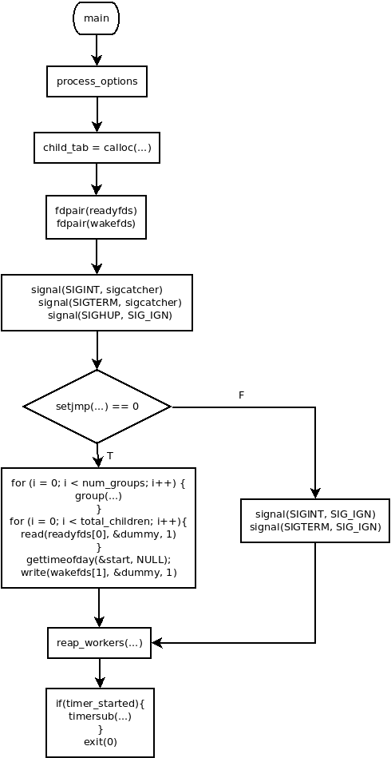

# 概述

hackbench用来定位系统中的瓶颈，这些瓶颈应该被消除或优化。

hackbench测试的是内核里的调度器。它还可以通过重复设置和删除线程来对内存子系统进行压力测试。此外，它还可以在一定程度上对进程间通信（如本地的网络插座，管道等）进行压力测试。

它可以测试系统的负载，但不能精确测试应用的负载，因为它不测试与设备的通信。

它创建若干对可调度实体（进程或线程），每对调度实体之间通过网络插座或管道通信，它会记录每对之间来回发送数据的时间。

本程序的代码量为438行(不包含空行)。

# 使用

## 编译

```c++
# 编译与安装
sudo apt-get install build-essential libnuma-dev    # 安装编译环境和必需的库
git clone git://git.kernel.org/pub/scm/utils/rt-tests/rt-tests.git
cd rt-tests
git checkout stable/v1.0    # master分支不是稳定版，所以要切换到stable分支
make all
make install
```
## 参数

```c++
-p, --pipe    # 使用管道发送数据。（默认用网络插座发送数据。）
-s, --datasize=<SIZE>    # 每条消息的大小。默认100字节。
-l, --loops=<NUM>    # 每个实体发送消息的数量。默认100条。
-g, --groups=<NUM>    # 指定可调度实体的对数。默认10对。
-f, --fds=<NUM>    # 每个实体要用的文件描述符数量。默认40个。
-T, --threads    # 创建的是线程。
-P, --process    # 创建的是进程。默认参数。
-F, --fifo      # 让主线程参数实时调度，可以精确计算时间。
--help
```
## 例子

```bash
# 示例
hackbench    # 创建10对进程，每个进程都通过网络插座发100条数据，每条数据包含100字节，每个进程使用40个文件描述符。
hackbench -p -T    # 创建10对线程，每个线程都通过管道发100条数据，每条数据包含100字节，每个线程使用40个文件描述符。
hackbench -s 512 -l 200 -g 15 -f 25 -P    # 创建15对进程，每个进程都通过网络插座发200条数据，每条数据包含512字节，每个进程使用25个文件描述符。
```
# 代码解析

## 参数解析

* 一对可调度实体由发送者和接收者组成，一对文件描述符就对应了一对可调度实体。
    * -f选项用于设置每个组文件描述符的对数，它会设置全局变量num_fds。
    * -g选项用于设置一共有多少个组，它会设置全局变量num_groups。
    由此可知道，一共会创建发送者(num_groups*num_fds)个，接收者(num_groups*num_fds)个，即总共会创建的实体数为(2*num_groups*num_fds)个。

* 一对可调度实体之间收发消息的大小由-s选项确定(单位是字节)，它会设置全局变量datasize。
而这对可调度实体之间收发消息的次数由-l选项确定，它会设置全局变量loops。

由此可知，每个发送者向接收者发送的字节总数是(loops*datasize)，而每个组里会送或接收消息(num_fds*loops)条。

* 可调度实体可以是线程，也可以是进程。这是由-P和-T选项确定的。
    * -P选项会设置全局变量process_mode为1(进程模式)，默认为进程模式。
    * -T选项会设置全局变量process_mode为0(线程模式)。
* 可调度实体之间可以通过管道通信，也可以通过网络插座通信，这是由-p选项确定的。
    * 默认使用网络插座通信(此时全局变量use_pipes=0)。
    * 如使用了-p选项则通过管道通信(此时全局变量use_pipes=1)。
* 主线程是要计算这些可调度实体之间全部通信时间的，如果想要精确地测量时间，主线程自己也需要是实时调度的，这时就可以用-F选项将全局变量fifo设置为1。
## 执行过程解析

1. 使用process_options()函数解析程序接收到的参数，主要是在一个while循环里用getopt_long()函数完成的此功能，关于参数的具体功能请参考**参数解析**章。
2. 使用calloc()函数为所有的实体id创建保存它们的内存空间，即child_tab，从名字看也很直观，孩子的列表。从**参数解析**章可知，一共会创建的实体数为(2*num_groups*num_fds)个。
3. 使用fdpair()函数为readyfds和wakefds创建通道，它会用全局变量use_pipes进行判断，如非0则使用pipe()函数创建管道，否则使用socketpair()函数创建网络插座的通道。wakefds是主线程唤醒实体(发送者和接收者)收发数据的通道，readyfds是实体(发送者和接收者)向主线程通知自己已准备好的通道。
4. 通过signal()函数设置捕获SIGINT和SIGTERM信号并由sigcatcher函数执行，sigcatcher函数通过longjmp()函数跳转到setjmp并返回1。
5. 第一次执行setjmp()函数，它返回0，故走的if分支。若setjmp()不是第一次执行，则是因为捕获到了SIGINT和SIGTERM信号，从longjmp()返回的，返回值为1，此时走else分支。
    1. 在if分支里，首先使用group函数为每个组创建发送和接收的实体(线程或进程)。然后，如果指定了fifo，则设置调用线程(main)的调度算法为fifo，优先级为１，让main成为实时任务的目的让它有能力管理其它实体。然后，为每个组从readyfds[0]里读取1个字节，目的是让大家准备好。然后，记录下开始的时间start。然后，为每组向wakefds[1]写入1个字节唤醒实体开始工作。
    2. 在else分支里，表示接收到了用户给出的退出信号，则打印错误信息，忽略SIGINT和SIGTERM信号。
6. 如果是从前面的if分支过来的，则reap_workers()函数的signal_caught为0，则让所有的实体都开始执行；如是从else分支过来的，则signal_caught为1，则让所有的实体都退出。
7. 用gettimeofday()系统调用记录结束时间，如timer_started=1，说明计时正常，则打印时间差；否则，打印异常的信息。
8. 最后，是一些收尾工作，释放申请的内存，通过exit()系统调用退出。
## 发送者和接收者的执行过程

1 第一步都是执行reset_worker_signals()恢复SIGTERM和SIGINT，而不是忽略它们。

2 第二步都是执行ready(ctx->ready_out, ctx->wakefd)，通过readyfds通道给主线程发消息表示自己已准备好，然后在wakefds通道上等主线程把自己唤醒。

3 第三步，发送者在一个for循环里通过write系统调用不停发数据，接收者在一个for循环里通过read系统调用不停收数据，直到收发的数据达到全局变量datasize指定的大小。

## 流程图




