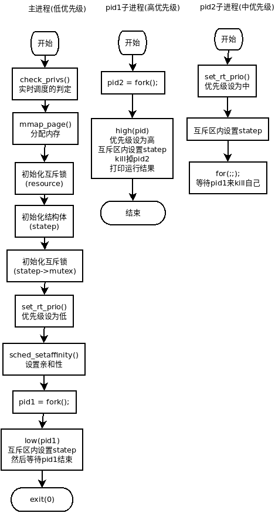

# pip_stress

## 概述

本程序测试进程间的优先级继承。本程序不接受任何参数，会在运行完毕后直接退出。

本程序会创建三个进程，这三个进程通过共享内存使用一个优先级继承的互斥锁，且都绑定在一个CPU上。最低优先级的进程持有互斥锁，然后中等优先级的进程抢占它，然后最高优先级的进程抢到这个互斥锁。由于优先级继承互斥锁使用的低优先级进程借给高优先级进程的优先级来解锁互斥锁，这就会阻止中优先级进程阻塞高优先级进程。

本程序的代码量为307行(不包含空行)。

## 编译

当rt-tests测试套件安装完成后，本程序就被安装在/usr/local/bin目录下。

```c++
# 编译安装rt-tests测试套件
sudo apt-get install build-essential libnuma-dev    # 安装编译环境和必需的库
git clone git://git.kernel.org/pub/scm/utils/rt-tests/rt-tests.git
cd rt-tests
git checkout stable/v1.0    # master分支不是稳定版，所以要切换到stable分支
make all
make install
```
## 执行过程

1. 首先，获取SCHED_FIFO的最小优先级。
2. 然后，执行check_privs()函数，它会判断如果当前是线程运行在实时调度器上(SCHED_FIFO和SCHED_RR)，或者可以切换为实时调度，则返回0，否则返回1。
3. 然后，执行mmap_page()函数，通过mmap()函数分配一个页大小的共享内存。此内存区域的第一部分是联合类型**pthread_mutex_t**
4. 然后，通过init_shared_pthread_mutex()函数初始化mutex。此函数首先使用process_shared_mutex_available()通过sysconf()函数判断能否获取环境变量_SC_THREAD_PROCESS_SHARED的值，不能会报错。然后使用Pthread_mutexattr_init()通过pthread_mutexattr_init()初始化联合类型pthread_mutexattr_t，然后使用Pthread_mutexattr_setpshared通过调用对应函数为attr设置进程共享标志PTHREAD_PROCESS_SHARED，然后使用Pthread_mutexattr_setprotocol通过调用对应函数为attr设置mutex协议PTHREAD_PRIO_INHERIT，最后使用Pthread_mutex_init()通过调用对应函数初始化mutex(利用之前的设置的attr)。
5. 然后，此内存区域的第二部分是State结构体，它用一些整型变量来记录优先级的继承是否发生。调用init_state()函数来初始化此结构体。
6. 然后，此内存区域的第三部分还是联合类型pthread_mutex_t，此mutex被init_shared_pthread_mutex()初始化，并指明其协议为PTHREAD_PRIO_NONE。
7. 然后，使用set_rt_prio()通过sched_setscheduler()设置主线程的调度策略为SCHED_FIFO，优先级为之前获取的SCHED_FIFO的最小优先级。
8. 然后，设置程序对0号CPU的亲和性。具体过程为，调用CPU_ZERO()清空结构体cpu_set_t，然后调用CPU_SET()把0号CPU加到结构体setp里，最后调用sched_setaffinity在结构体setp里设置0号CPU的亲和性。
9. 最后进行进程间优先级继承的测试。首先，通过fork()函数创建子进程pid1，拥有低优先级的主线进程继续执行low(pid1)。同时，拥有高优先级的子进程pid1通过fork()函数创建子进程pid2，接下来继续执行high(pid2)。同时，拥有中等优先级的子进程pid2执行medium()。当子进程pid1和pid2都结束后，主进程调用exit()函数退出。
```c++
struct State {
    int low_owns_resource;
    int high_started;
    int high_owns_resource;
    int medium_started;
    int inversion;
    pthread_mutex_t *mutex;
};
```
* low(pid1)的执行过程：给resource加互斥锁，给statep->mutex加互斥锁，给statep->low_owns_resource=1（因为执行此函数的主进程为低优先级进程），解除statep->mutex的互斥锁，执行usleep()函数睡500ms，解除resource的互斥锁，执行waitpid()等pid1结束。
* high(pid2)的执行过程：通过set_rt_prio()函数将当前进程(即pid1)提升为高优先级，在互斥区statep->mutex将statep->high_started置1，在双重互斥区(resource和statep->mutex)将statep->high_owns_resource置1，结束pid2，通过waitpid()等待pid2结束，在互斥区statep->mutex，如statep->inversion非0则调用printf()函数打印测试成功的信息，否则打印测试失败的信息。
* medium()执行的过程：通过set_rt_prio()函数将当前进程(即pid2)提升为中优先级，在互斥区statep->mutex内将statep->medium_started置1，然后在for(;;)里无限循环。
## 流程图



# pi_stress

## 概述

对互斥锁的优先级继承的压力测试。它作为时间优先级任务运行，并启动inversion machine thread groups。每个inversion group都会导致优先级反转条件，这样如果优先级继承不起作用则会死锁。

注：pi_stress线程是作为SCHED_FIFO或SCHED_RR线程运行的，这意味着它们可以使系统关键线程饥饿。建议在pi_stress之前把系统关键线程的调度策略改为SCHED_FIFO，并使用10以上的优先级，以避免pi_stress使这些线程饥饿。

本程序的代码量为1269行，不包含空行。

## 编译

当rt-tests测试套件安装完成后，本程序就被安装在/usr/local/bin目录下。

```c++
# 编译安装rt-tests测试套件
sudo apt-get install build-essential libnuma-dev    # 安装编译环境和必需的库
git clone git://git.kernel.org/pub/scm/utils/rt-tests/rt-tests.git
cd rt-tests
git checkout stable/v1.0    # master分支不是稳定版，所以要切换到stable分支
make all
make install
```
## 参数

```c++
pi_stress [options]
# 选项
-i, --inversions=<n>    # 指定反转条件的数量，即所有inversion group可以反转条件的总数。默认是-1代表无限次。
-t, --duration=<n>        # 指定测试运行时间为n秒。
-g, --groups=<n>        # inversion group的数量，默认10.
-d, --debug        # 调试模式，会输出大量信息
-v, --verbose    # 输出详细信息
-s, --sched    # 调度选项。
-r, --rr        # 让inversion threads作为SCHED_RR(round-robin)线程运行。默认是SCHED_FIFO。
-p, --prompt    # 在真正进行压力测试之前进行提示
-u, --uniprocesor    # 用一个处理器运行所有的线程。默认是inversion threads在一个处理器，admin threads在其它的处理器。
-m, --mlockall    # 锁定当前及未来的内存分配，以防止被换页的时候换出
-q, --quiet
-V, --version
-?, -h, --help
```
## 例子

```bash
pi_stress --verbose --duration 60  # 运行60秒，输出详细信息
```
## 执行过程

1. 使用setvbuf()为stdout分配新缓冲区，确保我们可以看到所有的信息，包括stdout。
2. 使用sysconf()获取处理器的数量。
3. 计算反转组的数量，似乎1个CPU对应1个反转组。
4. 使用process_command_line()处理参数。
    * 参数?、h：执行usage()函数，打印简单的帮助信息，然后执行exit()直接退出。
    * 参数t：使用strtol()函数给对应全局变量duration赋值。默认值为-1永不停止。
    * 参数v：全局变量verbose置1，且全局变量quiet置0.
    * 参数q：全局变量verbose置0，且全局变量quiet置1.
    * 参数i：使用strtol()函数给全局变量inversions赋值。
    * 参数g：使用strtol()函数给全局变量ngroups赋值。
    * 参数r：将全局变量policy赋值为SCHED_RR。默认值为SCHED_FIFO。
    * 参数s：执行process_sched_line()函数以修改全局变量sa_initialized 。
    * 参数p：将全局变量prompt赋值为1 。
    * 参数d：将全局变量debugging赋值为1 。
    * 参数V：打印VERSION的值并调用exit()退出。
    * 参数u：将全局变量uniprocessor赋值为1 。
    * 参数m：将全局变量lockall赋值为1 。
5. 调用setup_sched_config()函数依据sa_initialized的值分别设置全局变量low_as、med_sa、high_sa、admin_sa的值，它们分别代表了每个线程的调度属性。
6. 如lockall==1，意味着用户要求锁定内存，此时会执行mlockall()函数实现此功能。
7. 使用block_signals()函数阻塞所有的信号，这是通过pthread_sigmask()函数实现的。
8. 使用calloc()函数为所有组的结构体分配空间，即以`struct group_parameters`为元素的数组。
9. 使用set_cpu_affinity()设置CPU的亲和性。
    1. 两个参数test_cpu_mask和admin_cpu_mask是两个全局变量，它们是结构体cpu_set_t，分别代表了测试进程的CPU集合和主进程的CPU集合。
    2. 如CPU仅有一个核，则不存在亲和性的问题，把0号核加到test_cpu_mask和admin_cpu_mask，然后直接返回。
    3. 判断当前线程使用的CPU是不是已知的CPU，不是则返回FAILURE表示出错了。
    4. 设置当前线程使用的CPU和当前线程的亲和性。当前线程即为主线程，故修改的是admin_cpu_mask。
    5. 把当前线程使用的CPU之后的核都加到test_cpu_mask里，返回SUCCESS。
10. 计算总的线程数ngroups。
11. 使用barrier_init()设置ready屏障。即使用pthread_barrier_init()为全局变量all_threads_ready设置屏障。
12. 使用barrier_init()设置done屏障。即使用pthread_barrier_init()为全局变量all_threads_done设置屏障。
13. 使用for循环为每个组分配CPU核，使用create_group()为每个组创建3个测试线程。create_group()的工作流程如下：
    1. 使用initialize_group()初始化该组对应的数据结构`struct group_parameters`。
    2. 通过变量mask设置当前组所应的CPU核。
    3. 通过pthread_create()创建low_tid线程，对应的代码为low_priority()
    1. 通过pthread_create()创建med_tid线程，对应的代码为med_priority()
    1. 通过pthread_create()创建high_tid线程，对应的代码为high_priority()
    4. 返回
14. 如果用户指定了-p选项，即要求在开始测试之前提示一下，则全局变量prompt为1，此时会要求用户按下任意键才开始正式测试。
15. 调用banner()打印出关于测试的详细信息，用全局变量start记录下开始测试的时间。
16. 调用pthread_barrier_wait()让所有all_threads_ready上的线程等待。
17. 使用reporter()报告进展和检查死锁。
18. 使用set_shutdown_flag()在互斥区内把全局变量shutdown置1。
19. 执行pthread_barrier_wiat()让所有all_threads_done上的线程等待。
20. 记录测试结束的时间finish。
21. 调用sumary()报告统计的结果。
22. 调用exit()退出。
## 低优先级线程

1. 调用 pthread_barrier_wait()等待所有all_threads_ready上的线程。
2. 在一个for(;;)无限循环中：
    1. 调用 pthread_barrier_wait()等待所有loop_barr上的线程。
    1. 调用 pthread_barrier_wait()等待所有p->start_barrier上的线程。
    1. 调用 pthread_barrier_wait()等待所有p->locked_barrier上的线程。
    1. 调用 pthread_barrier_wait()等待所有p->evevate_barrier上的线程。
    1. 调用 pthread_barrier_wait()等待所有p->finish_barrier上的线程。
3. 调用set_shutdown_flag()把shutdown置1.
4. 调用 pthread_barrier_wait()等待所有all_threads_done上的线程。
5. 返回
## 中优先级线程

1. 调用 pthread_barrier_wait()等待所有all_threads_ready上的线程。
2. 在一个for(;;)无限循环中：
    1. 调用 pthread_barrier_wait()等待所有loop_barr上的线程。
    1. 调用 pthread_barrier_wait()等待所有p->start_barrier上的线程。
    1. 调用 pthread_barrier_wait()等待所有p->locked_barrier上的线程。
    1. 调用 pthread_barrier_wait()等待所有p->evevate_barrier上的线程。
    1. 调用 pthread_barrier_wait()等待所有p->finish_barrier上的线程。
3. 调用set_shutdown_flag()把shutdown置1.
4. 调用 pthread_barrier_wait()等待所有all_threads_done上的线程。
5. 返回
## 高优先级线程

1. 调用 pthread_barrier_wait()等待所有all_threads_ready上的线程。
2. 在一个for(;;)无限循环中：
    1. 调用 pthread_barrier_wait()等待所有loop_barr上的线程。
    1. 调用 pthread_barrier_wait()等待所有p->start_barrier上的线程。
    1. 调用 pthread_barrier_wait()等待所有p->locked_barrier上的线程。
    1. 调用 pthread_barrier_wait()等待所有p->evevate_barrier上的线程。
    1. 调用 pthread_barrier_wait()等待所有p->finish_barrier上的线程。
3. 调用set_shutdown_flag()把shutdown置1.
4. 调用 pthread_barrier_wait()等待所有all_threads_done上的线程。
5. 返回
