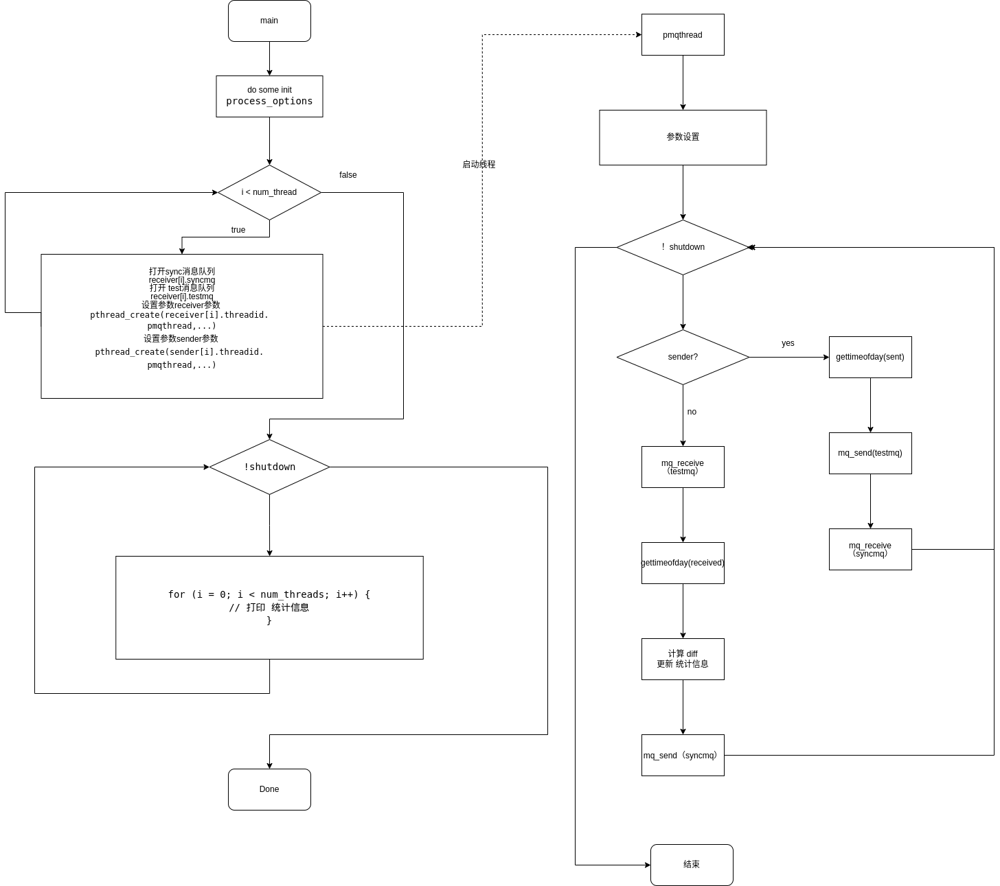

# pmqtest 文档
#  概述
测试 POSIX 消息队列 延时
## 思路
准备一些配置参数，在主线程中初始化好线程需要的变量，根据线程数量启动线程数量个线程对,通过mq_send/mq_receive() 同步的线程对,并在前后使用gettimeofday测量释放和获取锁之间的延迟。主线程负责统计性能。
## 原理

主线程 启动 一个 线程对，一个 发送 一个  接受 ， 通过 mq_receive 来暂停线程 等待接收，同过mq_send 来通知 对方运行 ， 在 sender 线程中 ，获得当前时间  发送 信息到队列，等待，在receive线程中 等待接受 ，然后记录当前时间。

这样 大概就可以 统计出 消息队列执行的延迟 
# 使用
##  编译
当rt-tests测试套件安装完成后，本程序就被安装在/usr/local/bin目录下。
```
# 编译安装rt-tests测试套件
sudo apt-get install build-essential libnuma-dev    # 安装编译环境和必需的库
git clone git://git.kernel.org/pub/scm/utils/rt-tests/rt-tests.git
cd rt-tests
git checkout stable/v1.0    # master分支不是稳定版，所以要切换到stable分支
make all
make install
```
## 参数
```
-a, --affinity[=PROC]
    在处理器编号 PROC 上运行。如果未指定 PROC，则在当前处理器上运行。
-b, --breaktrace=USEC
    当延迟 > USEC 时发送中断跟踪命令。这是一个调试选项，用于控制实时抢占补丁中的延迟跟踪器。跟踪系统意外的大延迟很有用。
-d, --distance=DIST
    以微秒为单位设置线程间隔的距离（默认为 500 微秒）。当使用 -t 选项调用 pmqtest 并且创建了多个线程时，则将此距离值添加到线程的间隔中：Interval(thread N) = Interval(thread N-1) + DIST
-f, --forcetimeout=TO
    设置发送函数的人为延迟以强制接收器超时，需要 -T 选项
-i, --interval=INTV
    以微秒为单位设置线程的基本间隔（默认为 1000 微秒）。这将设置第一个线程的间隔。另见-d。
-l, --loops=LOOPS
    设置循环次数。默认值为 0（无限）。此选项对于具有给定测试周期数的自动化测试很有用。一旦达到计时器间隔的数量，pmqtest 就会停止。
-p, --prio=PRIO
    设置进程的优先级。
-S, --smp
    对称多处理的测试模式，意味着 -a 和 -t 并在所有线程上使用相同的优先级。
-t, --threads[=NUM]
    设置测试线程的数量（如果未给出此选项，则默认为 1）。如果指定了 NUM，则创建 NUM 测试线程。如果未指定 NUM，则将 NUM 设置为可用 CPU 的数量。
-T, --timeout=TO
    使用 mq_timedreceive() 而不是 mq_receive() 并以秒为单位指定超时 TO。

```
## 例子
在八个cpu核上运行测试用例
```
# pmqtest -Sp99 -i100 -d0
#0: ID10047, P99, CPU0, I100; #1: ID10048, P99, CPU0, Cycles 153695
#2: ID10049, P99, CPU1, I100; #3: ID10050, P99, CPU1, Cycles 154211
#4: ID10051, P99, CPU2, I100; #5: ID10052, P99, CPU2, Cycles 156823
#6: ID10053, P99, CPU3, I100; #7: ID10054, P99, CPU3, Cycles 158202
#8: ID10055, P99, CPU4, I100; #9: ID10056, P99, CPU4, Cycles 153399
#10: ID10057, P99, CPU5, I100; #11: ID10058, P99, CPU5, Cycles 153992
#12: ID10059, P99, CPU6, I100; #13: ID10060, P99, CPU6, Cycles 156576
#14: ID10061, P99, CPU7, I100; #15: ID10062, P99, CPU7, Cycles 157957
#1 -> #0, Min    1, Cur    8, Avg    5, Max   18
#3 -> #2, Min    1, Cur    4, Avg    5, Max   18
#5 -> #4, Min    1, Cur    5, Avg    5, Max   19
#7 -> #6, Min    1, Cur    4, Avg    4, Max   17
#9 -> #8, Min    1, Cur    9, Avg    5, Max   18
#11 -> #10, Min    1, Cur    8, Avg    5, Max   18
#13 -> #12, Min    1, Cur    4, Avg    5, Max   29
#15 -> #14, Min    1, Cur    8, Avg    4, Max   17


```
## 数据含义

```
#0          标号偶数 是 接收线程
ID10047      线程id
P99         线程优先级 
CPU0        线程运行所在的cpu 
I100        唤醒数间100us
#1          标号奇数 是 发送线程 
ID8673      线程id
P99         线程优先级 
CPU0        线程运行在的cpu
Cycles      运行循环的次数

#1 -> #0, Min    1, Cur    1, Avg    2, Max   11

#1 -> #0
标号1的线程 向 标号0线程 发送消息

Min 1 
历史最小 延迟 是 1us

Cur 1
当前这次的延时 是 1us

Max 11
历史最大延迟 是 11us
```

## 性能指标
Max  
主要 观测 max 的 数值，这个数值 体现出 在系统中，当一方已经接收阻塞，另一方发送，解除阻塞，多久能获得执行的延迟，
测试的延迟 ，综合体现了多线程调度，上下文切换，锁的性能。

# 实现方法
## 定义
线程参数 结构体
```
struct params {
	int num;
	int cpu;
	int priority;
	int affinity;
	int sender;
	int samples;
	int max_cycles;
	int tracelimit;
	int tid;
	int shutdown;
	int stopped;
	struct timespec delay;
	unsigned int mindiff, maxdiff;
	double sumdiff;
	struct timeval sent, received, diff;
	pthread_t threadid;
	int timeout;
	int forcetimeout;
	int timeoutcount;
	mqd_t syncmq, testmq;
	char recvsyncmsg[MSG_SIZE];
	char recvtestmsg[MSG_SIZE];
	struct params *neighbor;
	char error[MAX_PATH * 2];
};
```
## 方法
互斥量线程
```
void *pmqthread(void *param)
```
根据 传入的param 判断是 sender 还是  receiver 执行对应收发逻辑
## syscall

消息队列
```
#include<mqueue.h>
// 打开一个 消息队列 返回 描述符
mqd_t mq_open(const char *name, int oflag)
// 关闭 一个 消息队列 
mqd_t mq_close(mqd_t mqdes);
// 删除 一个 消息队列 
mqd_t mq_unlink(const char *name);
// 发送 信息 到 消息队列
mqd_t mq_send(mqd_t mqdes, const char *msg_ptr,size_t msg_len, unsigned msg_prio);
// 接收 消息 从 消息队列
mqd_t mq_receive(mqd_t mqdes, char *msg_ptr, size_t msg_len,unsigned *msg_prio); 

```

# 实现分析

## 流程图



__主线程__

从 main 函数入口，分析其主要运行逻辑
```C

int main(int argc, char **argv)
{
	// 声明 参数
	struct params *receiver = NULL;
	struct params *sender = NULL;

	// 声明 设置 消息队列 属性
	struct mq_attr mqstat;
	// 清零
	memset(&mqstat, 0, sizeof(mqstat));
	// 队列 最大 消息 1
	mqstat.mq_maxmsg = 1;
	// 消息 大小 8
	mqstat.mq_msgsize = 8;
	// flags 0
	mqstat.mq_flags = 0;

	// 处理 进程 配置选项
	process_options(argc, argv, max_cpus);
	
	// 分配 接受 和 发送 的 参数 空间
	receiver = calloc(num_threads, sizeof(struct params));
	sender = calloc(num_threads, sizeof(struct params));

	...

}
```
声明 和 分配 空间 ， 主要 用到 的  receiver ， sender 是 保存对应线程状态和参数的数组，长度 由 设定 的 线程 数目 决定，mqstat 是用来设置消息队列的属性，通过消息队列的收发 ，来计算延迟，从而 统计对比，内核性能。
```C
...
// 循环开启新线程
for (i = 0; i < num_threads; i++) {
		
		...
		// 打开sync消息队列
		sprintf(mqname, SYNCMQ_NAME, i);
		receiver[i].syncmq = mq_open(mqname, oflag, 0777, &mqstat);

		// 打开 test消息队列
		sprintf(mqname, TESTMQ_NAME, i);
		receiver[i].testmq = mq_open(mqname, oflag, 0777, &mqstat);


		... 
		// 对 receiver ， 设置 参数
		...
		// 指定 sender
		receiver[i].neighbor = &sender[i];
		// 创建 新 线程 运行 pmqthread
		pthread_create(&receiver[i].threadid, NULL, pmqthread, &receiver[i]);
		memcpy(&sender[i], &receiver[i], sizeof(receiver[0]));
		sender[i].sender = 1;
		// 指定receiver
		sender[i].neighbor = &receiver[i];
		// 创建 新 线程 运行 pmqthread
		pthread_create(&sender[i].threadid, NULL, pmqthread, &sender[i]);
}
...
```
接下来进入 根据 设置的线程个数 开启新线程对，对 receiver和sender 设置好参数
开启新线程，并指定 pmqthread 函数 作为 入口点
```C
// 统计线程 
	while (!shutdown) {
		// 主要负责 打印 开启的线程的统计信息
		...
		for (i = 0; i < num_threads; i++) {
			// 打印 统计信息
		}
		...
	}
```
在主线程内 负责 打印刚才 开启的线程的recevice 和  sender 统计信息。

__计时器线程__  
根据 sender 和 receiver ，执行 计时 ， 解锁， 计时 ，然后在上锁等待下次 同步
```C
void *pmqthread(void *param)
{

	...
	while (!par->shutdown) {
		// 如果是发送者
		if (par->sender) {
			// 获取 send 时间
			gettimeofday(&par->sent, NULL);
			// send 把 msg指针 加入 msg des 队列 
			if (mq_send(par->testmq, testmsg, strlen(testmsg), 1) != 0) {
				fprintf(stderr, "could not send test message\n");
				par->shutdown = 1;
			}
			par->samples++;
			// 判断 是否 结束
			if(par->max_cycles && par->samples >= par->max_cycles)
				par->shutdown = 1;
			// 阻塞 接收
			if (mq_receive(par->syncmq, par->recvsyncmsg, MSG_SIZE, NULL) !=
			    strlen(syncmsg)) {
				perror("could not receive sync message");
				par->shutdown = 1;				
			}
			...
		} else {
			/* Receiver */
			// 接收者
			...
			// 阻塞等待接收
			if (mq_receive(par->testmq, par->recvtestmsg, MSG_SIZE, NULL) !=
				    strlen(testmsg)) {
					perror("could not receive test message");
					par->shutdown = 1;
				}

			// 获得 时间  接收时间
			gettimeofday(&par->received, NULL);
			// 当前循环 ++ 
			par->samples++;


			// 计算差 值  接收-发送 = 锁的延迟
			timersub(&par->received, &par->neighbor->sent,
			    &par->diff);

			if (par->diff.tv_usec < par->mindiff)
				par->mindiff = par->diff.tv_usec;
			if (par->diff.tv_usec > par->maxdiff)
				par->maxdiff = par->diff.tv_usec;
			
			// 判断是否结束
			if (par->max_cycles && par->samples >= par->max_cycles)
				par->shutdown = 1;
			// 告诉 sender 准备 下次测量
			if (mq_send(par->syncmq, syncmsg, strlen(syncmsg), 1) != 0) {
				fprintf(stderr, "could not send sync message\n");
				par->shutdown = 1;
			}
		}
	}
	par->stopped = 1;
	return NULL;
	// ...
}
```


# 引用
<div id="refer-anchor-1"></div>  

- [1] [pmqtest wiki](https://manpages.debian.org/stretch/rt-tests/pmqtest.8.en.html)


<div id="refer-anchor-2"></div>  

- [2] [消息队列](https://blog.csdn.net/anonymalias/article/details/9799645)
