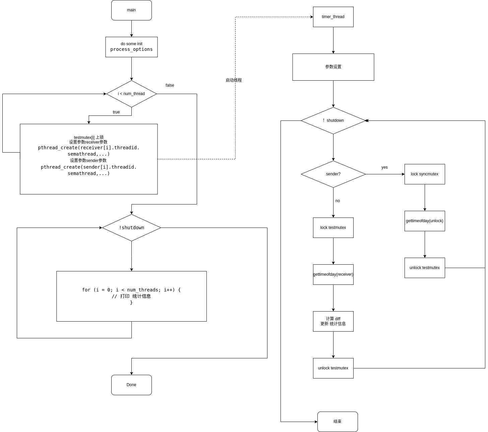

# ptsematest 文档
#  概述
测试 POSIX 线程 互斥量 延时
## 思路
准备一些配置参数，在主线程中初始化好线程需要的变量，根据线程数量启动线程数量个线程对,通过pthread_mutex_lock(),pthread_mutex_unlock()方式同步线程,并在前后使用gettimeofday测量释放和获取锁之间的延迟。主线程负责统计性能。
## 原理

使用两种 信号量 ， testmutex 和 syncmutex , testmutex 使用来测试延迟的，syncmutex是用来同步 ,接受发送的。并且 testmutex 全部上锁。

每设置 一个 线程对，要开启两个线程 一个 sender 一个 receiver，

在 一个 线程对里 ， sender 方 ，先对 syncmutex 上锁，然后 获取 当前时间，然后 在 testmutex 解锁。

received 线程 ，上来 对 testmutex 上锁，因为 在线程开始前，testmutex 是锁着的所以等待，当sender方，释放锁后，获得执行，立刻统计当前时间，然后对 syncmutex，解锁。

这样 统计 两个时间差，能计算出 信号量 使用 了 多少延时。 
# 使用
##  编译
当rt-tests测试套件安装完成后，本程序就被安装在/usr/local/bin目录下。
```
# 编译安装rt-tests测试套件
sudo apt-get install build-essential libnuma-dev    # 安装编译环境和必需的库
git clone git://git.kernel.org/pub/scm/utils/rt-tests/rt-tests.git
cd rt-tests
git checkout stable/v1.0    # master分支不是稳定版，所以要切换到stable分支
make all
make install
```
## 参数
```
-a [NUM] --affinity 
					在处理器#N上运行线程#N，如果可能的话
          用NUM将所有线程钉在处理器NUM上
-b USEC --breaktrace=USEC 
					当延迟大于USEC时，发送中断跟踪命令
-d DIST --distance=DIST 
					线程间隔的距离，单位是us 默认=500
-i INTV --interval=INTV
					线程的基本间隔，单位：us 默认=1000
-l LOOPS --loops=LOOPS 
					循环数：默认=0(无尽)
-p PRIO --prio=PRIO
					优先级
-S      --smp 
					SMP测试：选项-a -t和相同的优先级的所有线程
-t      --threads 
					每个可用的处理器有一个线程
-t [NUM] --threads=NUM 
					线程数。
          没有NUM，线程数=max_cpus
          没有-t默认=1
```
## 例子
在四个cpu核上运行测试用例
```
   # ptsematest -a -t -p99 -i100 -d25 -l1000000
   #0: ID8672, P99, CPU0, I100; #1: ID8673, P99, CPU0, Cycles 1000000
   #2: ID8674, P98, CPU1, I125; #3: ID8675, P98, CPU1, Cycles 811035
   #4: ID8676, P97, CPU2, I150; #5: ID8677, P97, CPU2, Cycles 668130
   #6: ID8678, P96, CPU3, I175; #7: ID8679, P96, CPU3, Cycles 589423
   #1 -> #0, Min    1, Cur    1, Avg    2, Max   11
   #3 -> #2, Min    1, Cur    2, Avg    2, Max   13
   #5 -> #4, Min    1, Cur    4, Avg    3, Max   12
   #7 -> #6, Min    1, Cur    4, Avg    2, Max   12
```
* -a 开启 亲和性   每个 线程只在固定 cpu上运行不混用cpu核
* -t  根据 每个 可用 的 处理器 启用一个线程
* -p 把线程优先级 设置为99(最高) 优先调度
* -i  线程唤醒时间设置为100us
* -d 每个 进程 多错开 25us
* -l 循环 1_000_000 边
## 数据含义

```
#0          标号偶数 是 接收线程
ID8672      线程id
P99         线程优先级 
CPU0        线程运行所在的cpu 
I100        唤醒数间100us
#1          标号奇数 是 发送线程 
ID8673      线程id
P99         线程优先级 
CPU0        线程运行在的cpu
Cycles      运行循环的次数

#1 -> #0, Min    1, Cur    1, Avg    2, Max   11

#1 -> #0
标号1的线程 向 标号0线程 发送消息

Min 1 
历史最小 延迟 是 1us

Cur 1
当前这次的延时 是 1us

Max 11
历史最大延迟 是 11us
```

## 性能指标
Max  
主要 观测 max 的 数值，这个数值 体现出 在系统中，当一方已经阻塞，另一方释放了锁，多久能获得执行的延迟，（仅有双方使用这个锁）
测试的延迟 ，综合体现了多线程调度，上下文切换，锁的性能。

# 实现方法
## 定义
定义两个互斥量  
测试锁  
```
static pthread_mutex_t *testmutex;
```
同步锁
```
static pthread_mutex_t *syncmutex;
```
线程参数 结构体
```C
struct params {
	int num;
	int cpu;
	int priority;
	int affinity;
	int sender;
	int samples;
	int max_cycles;
	int tracelimit;
	int tid;
	int shutdown;
	int stopped;
	struct timespec delay;
	unsigned int mindiff, maxdiff;
	double sumdiff;
	struct timeval unblocked, received, diff;
	pthread_t threadid;
	struct params *neighbor;
	char error[MAX_PATH * 2];
};
```
## 方法
互斥量线程
```
void *semathread(void *param)
```
根据 传入的param 判断是 sender 还是  receiver 执行对应收发逻辑
## syscall
锁是程序中经常需要用到的机制，尤其是多线程的程序中，如果没有锁的帮助，线程间的同步就会非常麻烦。[<sup>1</sup>](#refer-anchor-1) 
```
#include <pthread.h>

静态初始化
pthread_mutex_t mutex = PTHREAD_MUTEX_INITIALIZER;

初始化 一个互斥锁
int pthread_mutex_init(pthread_mutex_t *restrict mutex,const pthread_mutexattr_t *restrict attr);

销毁一个互斥锁
int pthread_mutex_destroy(pthread_mutex_t *mutex);

对mutex 上锁
int pthread_mutex_lock(pthread_mutex_t *mutex);

对mutex 尝试上锁
int pthread_mutex_trylock(pthread_mutex_t *mutex);

对mutex 解锁
int pthread_mutex_unlock(pthread_mutex_t *mutex);
```
使用mutex的基本步骤就是：
定义muutex -> 初始化mutex -> 使用mutex(lock, unlock, trylock) -> 销毁mutex。


# 实现分析

## 流程图



## 代码

__主线程__

从 main 函数入口，分析其主要运行逻辑
```C
// 互斥量
static pthread_mutex_t *testmutex;
static pthread_mutex_t *syncmutex;

int main(int argc, char **argv)
{
	// 声明 参数
	struct params *receiver = NULL;
	struct params *sender = NULL;

	// 处理 进程 配置选项
	process_options(argc, argv, max_cpus);
	
	// 分配 接受 和 发送 的 参数 空间
	receiver = calloc(num_threads, sizeof(struct params));
	sender = calloc(num_threads, sizeof(struct params));


	// 分配 互斥量  的 空间，
	testmutex = (pthread_mutex_t *) calloc(num_threads, sizeof(pthread_mutex_t));
	syncmutex = (pthread_mutex_t *) calloc(num_threads, sizeof(pthread_mutex_t));

	...

}
```
声明 和 分配 空间 ， 主要 用到 的  receiver ， sender 是 保存对应线程状态和参数的数组，长度 由 设定 的 线程 数目 决定，testmutex，syncmutex是 这个测试 用来 测试 的互斥量，通过他们的 上锁 解锁，来计算延迟，从而 统计对比，内核性能。
```C
...
// 循环开启新线程
for (i = 0; i < num_threads; i++) {
		
		...

		// 互斥量  全部 动态 初始化
		pthread_mutex_init(&testmutex[i], NULL);
		pthread_mutex_init(&syncmutex[i], NULL);

		// 一开始 全部 test 上锁
		pthread_mutex_lock(&testmutex[i]);
		
		... 
		// 对 receiver ， 设置 参数
		...
		// 指定 sender
		receiver[i].neighbor = &sender[i];
		// 创建 新 线程 运行 semathread
		pthread_create(&receiver[i].threadid, NULL, semathread, &receiver[i]);
		memcpy(&sender[i], &receiver[i], sizeof(receiver[0]));
		sender[i].sender = 1;
		// 指定receiver
		sender[i].neighbor = &receiver[i];
		// 创建 新 线程 运行 semathread
		pthread_create(&sender[i].threadid, NULL, semathread, &sender[i]);
}
...
```
接下来进入 根据 设置的线程个数 开启新线程对，对 receiver和sender 设置好参数
开启新线程，并指定 semathread 函数 作为 入口点
```C
// 统计线程 
	while (!shutdown) {
		// 主要负责 打印 开启的线程的统计信息
		...
		for (i = 0; i < num_threads; i++) {
			// 打印 统计信息
		}
		...
	}
```
在主线程内 负责 打印刚才 开启的线程的recevice 和  sender 统计信息。

__计时器线程__  
根据 sender 和 receiver ，执行 计时 ， 解锁， 计时 ，然后在上锁等待下次 同步
```C
void *semathread(void *param)
{

	...
	while (!par->shutdown) {
		// 如果是发送者
		if (par->sender) {
			// 同步锁 上所
			pthread_mutex_lock(&syncmutex[par->num]);

			// 获取时间 发送时间
			gettimeofday(&par->unblocked, NULL);
			// 解锁
			pthread_mutex_unlock(&testmutex[par->num]);
			// 当前循环 ++
			par->samples++;
			// 结束
			if(par->max_cycles && par->samples >= par->max_cycles)
				par->shutdown = 1;
		} else {
			/* Receiver */
			// 接收者
			// 上锁 因为一开始 都上了锁 ，所以 接收者 等待 ，直到 sender 解锁
			pthread_mutex_lock(&testmutex[par->num]);

			// 获得 时间  接收时间
			gettimeofday(&par->received, NULL);
			// 当前循环 ++ 
			par->samples++;


			// 计算差 值  接收-发送 = 锁的延迟
			timersub(&par->received, &par->neighbor->unblocked,
			    &par->diff);
			// 更新 min  延迟 最小值
			if (par->diff.tv_usec < par->mindiff)
				par->mindiff = par->diff.tv_usec;
			// 更新 max  延迟 最大值
			if (par->diff.tv_usec > par->maxdiff)
				par->maxdiff = par->diff.tv_usec;
			par->sumdiff += (double) par->diff.tv_usec;
			
			// 判断是否结束
			if (par->max_cycles && par->samples >= par->max_cycles)
				par->shutdown = 1;
			// 解开 sender 的 锁
			pthread_mutex_unlock(&syncmutex[par->num]);
		}
	}
	par->stopped = 1;
	return NULL;
	// ...
}
```


# 引用

<div id="refer-anchor-1"></div>  

- [1] [互斥量](https://blog.csdn.net/qq_39736982/article/details/82348672)

