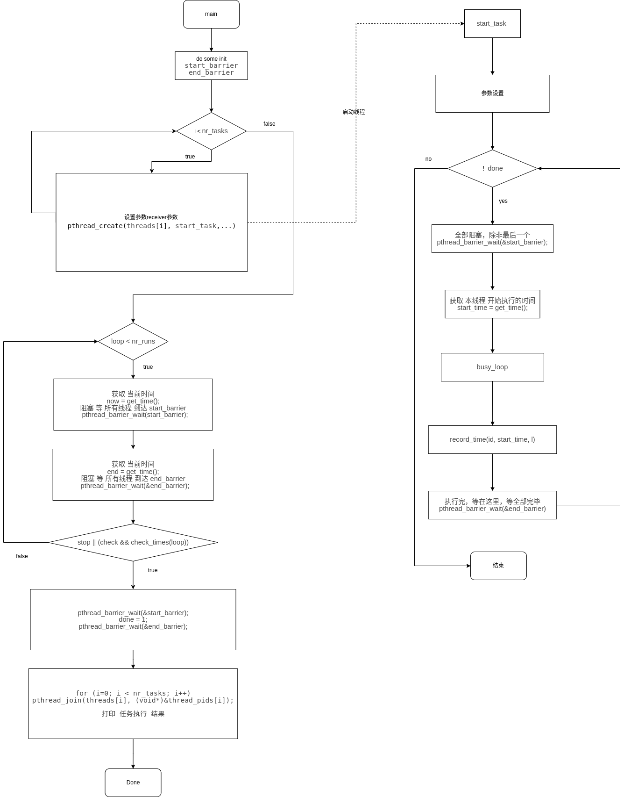

# ptsematest 文档
#  概述
实时任务迁移程序。测试任务在多处理器上的实时调度，以确保最高优先级的任务可以运行在所有CPU上。
## 思路
准备一些配置参数，在主线程中初始化好线程需要的变量，根据线程数量启动线程数量个线程对,通过pthread_mutex_lock(),pthread_mutex_unlock()方式同步线程,并在前后使用gettimeofday测量释放和获取锁之间的延迟。主线程负责统计性能。
## 原理

实时线程A，B，C。线程C优先级最高，线程B次之，线程A优先级最低。
还有一个主线程M，线程M的优先级比线程C还高。
线程A,B,C均循环执行如下代码:

// 挡住 所有 线程 到这个位置，一起开始调度
pthread_barrier_wait(&start_barrier);
// 执行 代码
busy_loop();
// 再次 挡住 所有代码 到这个 位置，查看先后顺序
pthread_barrier_wait(&end_barrier);

通过 这方式 来查看 进程 调度 情况 ，是否 符合 我们 预期 的 调度 算法。
# 使用
##  编译
当rt-tests测试套件安装完成后，本程序就被安装在/usr/local/bin目录下。
```
# 编译安装rt-tests测试套件
sudo apt-get install build-essential libnuma-dev    # 安装编译环境和必需的库
git clone git://git.kernel.org/pub/scm/utils/rt-tests/rt-tests.git
cd rt-tests
git checkout stable/v1.0    # master分支不是稳定版，所以要切换到stable分支
make all
make install
```
## 参数
```
-p prio --prio prio 
        启动RT任务的基本优先级(2) 
-r time --run-time time 
        运行时间(ms) 繁忙循环线程(20)
-s time --sleep-time time 
        睡眠时间(ms) 间隔时间(100)
-m time --maxerr time 
        最大允许误差（微秒）。
-l loops --loops loops
        运行的迭代次数(50)
-c --check 
        如果低优先级的任务比高优先级的任务更快，则停止（关闭）
 以上（）里是默认值 
```
## 例子

```
# rt-migrate-test	
```

## 数据含义


## 性能指标

# 实现方法
## 定义
定义两个屏障  
开始屏障 
```
static pthread_barrier_t start_barrier;
```
结束屏障
```
static pthread_barrier_t end_barrier;
```
## 方法
互斥量线程
```
void *start_task(void *param)
```
运行的计算的任务

```
static unsigned long busy_loop(unsigned long long start_time)
```
执行的计算
## syscall

```c
#include <linux/sched.h>
int sched_setscheduler(struct task_struct * , int , const struct sched_param *)
```

第一个参数是struct task_struct结构体类型的指针，保存进程的描述符信息
第二个参数是int型的变量，代表设置的进程的新的调度策略
#define SCHED_NORMAL       0        //普通进程调度策略
#define SCHED_FIFO         1        //用于软实时进程，先进先出调度策略
#define SCHED_RR           2        //用于软实时进程，循环调度策略
#define SCHED_BATCH        3        //非交互、CPU使用密集的批处理进程
#define SCHED_IDLE         5        //重要性比较低，不负责调度空闲进程
第三个参数是struct sched_param结构体类型的指针，保存设置进程的新的实时优先级


pthread_barrier 系列函数在<pthread.h>中定义，用于多线程的同步，它包含三个函数：
      --pthread_barrier_init()
      --pthread_barrier_wait()
      --pthread_barrier_destroy()

pthread_barrier_*其实只做且只能做一件事，就是充当栏杆（barrier意为栏杆)。形象的说就是把先后到达的多个线程挡在同一栏杆前，直到所有线程到齐，然后撤下栏杆同时放行。

1）init函数负责指定要等待的线程个数；
2） wait()函数由每个线程主动调用，它告诉栏杆“我到起跑线前了”。wait(）执行末尾栏杆会检查是否所有人都到栏杆前了，如果是，栏杆就消失所有线程继续执行下一句代码；如果不是，则所有已到wait()的线程停在该函数不动，剩下没执行到wait()的线程继续执行；
3）destroy函数释放init申请的资源。

# 实现分析

## 流程图



## 代码

__主线程__

从 main 函数入口，分析其主要运行逻辑
int main(int argc, char **argv)
```C
{
	// 初始化 要等待 的 任务数目
	ret = pthread_barrier_init(&start_barrier, NULL, nr_tasks + 1);
	ret = pthread_barrier_init(&end_barrier, NULL, nr_tasks + 1);
	...	
	参数 初始化
	...

}
```
main 函数 一开始 初始化 一些 参数 ，其中 start_barrier，end_barrier，指明了 要 等待 的 任务数目

```c
...
// 循环开启新线程
for (i = 0; i < nr_tasks; i++) {
	
	// 开启 新 线程 ，执行 start_task
	if (pthread_create(&threads[i], NULL, start_task, (void *)i))
			perr("pthread_create");
}
...
```
接下来进入 根据 线程个数
开启新线程，并指定 start_task 函数 作为 入口点


```c
// 统计线程 
	for (loop=0; loop < nr_runs; loop++) {
		unsigned long long end;
		// 获取 当前时间
		now = get_time();

		ftrace_write("Loop %d now=%lld\n", loop, now);
		
		// 阻塞 等 所有线程 到达 start_barrier
		pthread_barrier_wait(&start_barrier);
		// 全部 线程 已经 运行
		ftrace_write("All running!!!\n");

		nanosleep(&intv, NULL);

		print_progress_bar((loop * 100)/ nr_runs);

		end = get_time();
		ftrace_write("Loop %d end now=%lld diff=%lld\n", loop, end, end - now);
		// 阻塞 等 所有线程 到达 end_barrier
		pthread_barrier_wait(&end_barrier);

		// 判断 是否 结束
		if (stop || (check && check_times(loop))) {
			loop++;
			nr_runs = loop;
			break;
		}
	}
```
在主线程内 负责 barrier 的 开关 控制 ，刚才 启动的 线程 什么时候 运行，什么 时候 停止，来以此 记录运行 时间。


```c
	...
	pthread_barrier_wait(&start_barrier);
	done = 1;
	pthread_barrier_wait(&end_barrier);

	for (i=0; i < nr_tasks; i++)
		pthread_join(threads[i], (void*)&thread_pids[i]);

	print_results();
	...

```
等待 全部 结束 打印 任务执行 结果


__计时器线程__

在while循环中先到达 start barrier，等待可以执行，然后获取当前时间，进行计算 ， 然后 到达 end barrier 等待 计算延时。伪代码如下：
```C
void *start_task(void *param)
{

	... 参数设置

	while (!done) {
		// 全部阻塞，除非最后一个
		pthread_barrier_wait(&start_barrier);
		// 获取 本线程 开始执行的时间
		start_time = get_time();
		ftrace_write("Thread %d: started %lld diff %lld\n",
			     pid, start_time, start_time - now);
		l = busy_loop(start_time);
		record_time(id, start_time, l);
		// 执行完，等在这里，等全部完毕
		pthread_barrier_wait(&end_barrier);
	}
	// ...
}
```


# 引用


