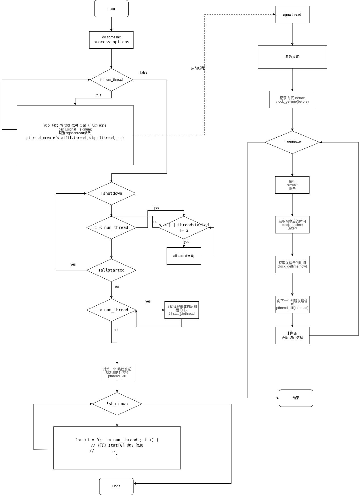

#  概述
信号往返延时测试
## 思路
signaltest通过起n个线程，每个线程函数开始后就循环阻塞地等待信号，由主线程向第一个线程发送post给第二个线程，第二个线程向第三个线程，这样一个线程一个线程之间互相接力发送post，到第n个线程再向第一个线程发送post。这样，各个线程之间又通过信号量组成了一个循环队列。
这些线程中的迭代计算从发送信号到下一个线程，线程接力传递信号，直到自己再次收到信号所需要的时间
## 原理

主线程 创建 n 个 线程，线程中 屏蔽信号SIGUSR1 ,然后执行 sigwait ，等待 被阻塞 信号，然后
主线程中 向 第一个 线程 通过 kill 发送 SIGUSR1 信号，第一个 线程中 进行 获取 当前时间 ，然后  通过 kill 发送 给下一线程 SIGISR1 ，以此类推，形成一个环，然后统计 第一个 线程 的 用时。

线程 越多  时间越长 ，但是 可以 综合 体现 singnal 的延迟。
# 使用
##  编译
当rt-tests测试套件安装完成后，本程序就被安装在/usr/local/bin目录下。
```
# 编译安装rt-tests测试套件
sudo apt-get install build-essential libnuma-dev    # 安装编译环境和必需的库
git clone git://git.kernel.org/pub/scm/utils/rt-tests/rt-tests.git
cd rt-tests
git checkout stable/v1.0    # master分支不是稳定版，所以要切换到stable分支
make all
make install
```
## 参数
```
-b USEC --breaktrace=USEC 
        当延迟大于USEC时，发送中断跟踪命令
-l LOOPS --loops=LOOPS
        循环次数：默认=0（无尽）。
-p PRIO --prio=PRIO
        最高prio线程的PRIO优先级
-q --quiet
        退出时只打印摘要
-t NUM --threads=NUM 
        线程数: default=2
-m --mlockall 
        锁定当前和未来的内存分配
-v --verbose
        在stdout上以verbose方式输出统计值
        格式：n:c:v n=tasknum c=count v=value in us
```
## 例子
在四个cpu核上运行测试用例
```
-a 开启 亲和性   每个 线程只在固定 cpu上运行不混用cpu核
-t  根据 每个 可用 的 处理器 启用一个线程
-p 把线程优先级 设置为99(最高) 优先调度
-i  线程唤醒时间设置为100us
-d 每个 进程 多错开 25us
-l 循环 1_000_000 边
   # ptsematest -a -t -p99 -i100 -d25 -l1000000
   #0: ID8672, P99, CPU0, I100; #1: ID8673, P99, CPU0, Cycles 1000000
   #2: ID8674, P98, CPU1, I125; #3: ID8675, P98, CPU1, Cycles 811035
   #4: ID8676, P97, CPU2, I150; #5: ID8677, P97, CPU2, Cycles 668130
   #6: ID8678, P96, CPU3, I175; #7: ID8679, P96, CPU3, Cycles 589423
   #1 -> #0, Min    1, Cur    1, Avg    2, Max   11
   #3 -> #2, Min    1, Cur    2, Avg    2, Max   13
   #5 -> #4, Min    1, Cur    4, Avg    3, Max   12
   #7 -> #6, Min    1, Cur    4, Avg    2, Max   12
```
## 数据含义

```
#0          标号偶数 是 接收线程
ID8672      线程id
P99         线程优先级 
CPU0        线程运行所在的cpu 
I100        唤醒数间100us
#1          标号奇数 是 发送线程 
ID8673      线程id
P99         线程优先级 
CPU0        线程运行在的cpu
Cycles      运行循环的次数

#1 -> #0, Min    1, Cur    1, Avg    2, Max   11

#1 -> #0
标号1的线程 向 标号0线程 发送消息

Min 1 
历史最小 延迟 是 1us

Cur 1
当前这次的延时 是 1us

Max 11
历史最大延迟 是 11us
```

## 性能指标
Max  
主要 观测 max 的 数值，这个数值 体现出 在系统中，当一方已经阻塞，另一方释放了锁，多久能获得执行的延迟，（仅有双方使用这个锁）
测试的延迟 ，综合体现了多线程调度，上下文切换，锁的性能。

# 实现方法

## 定义
线程参数 
```c
struct thread_param {
        int id;		// for循环的编号
        int prio;	// priority的值
        int signal;	// signum，即SIGUSR1
        unsigned long max_cycles;	// max_cycles的值
        struct thread_stat *stats;
        int bufmsk;	// stats->value的掩码
};
```
线程状态 统计
```c
struct thread_stat {
        unsigned long cycles;		// 测量循环的次数
        unsigned long cyclesread;	// 在输出子线程统计信息的时候记录读到第几次循环的数据了。
        long min;		// 等信号时延的最小值
        long max;		// 等信号时延的最大值
        long act;		// 等信号时延的实际值
        double avg;		// 等信号时延的平均值
        long *values;	// 记录了最近16384个时延的值
        pthread_t thread;	// 线程id，POSIX视角
        pthread_t tothread;	// 子线程排成一个圆圈传信号。0号传1号，1号传2号，... ，最后一个传0号。tothread就是指要传给的那个线程。
        int threadstarted;	// 1,开始子线程；2,开始循环测量；-1,线程结束。
        int tid;			// 线程id，内核视角
};
```
## 方法
信号子线程
```
void *signalthread(void *param) 
```
等待上一个子线程的信号，给下一个子线程发信号。
## syscall

等待信号
```
       #include <signal.h>

       int sigwait(const sigset_t *restrict set, int *restrict sig);

```
调用sigwait函数的线程挂起执行，等待信号到来

```       
#include <signal.h>

       int pthread_kill(pthread_t thread, int sig);

```
pthread_kill 函数发送信号SIG到线程

# 实现分析

## 流程图



## 代码

__主线程__

从 main 函数入口，分析其主要运行逻辑
```C

int main(int argc, char **argv)
{
	// 声明 参数
	// 信号集
	sigset_t sigset;
	// SIGUSR1 信号
	int signum = SIGUSR1;
	struct thread_param *par;
	struct thread_stat *stat;


	// 处理 进程 配置选项
	process_options(argc, argv, max_cpus);

	// 设置 SIGUSR1 为 未决 信号
	sigemptyset(&sigset);
	sigaddset(&sigset, signum);
	sigprocmask (SIG_BLOCK, &sigset, NULL);
	
	// 分配 参数 和 统计 的 空间
	par = calloc(num_threads, sizeof(struct thread_param));
	stat = calloc(num_threads, sizeof(struct thread_stat));
	...

}
```
声明 和 分配 空间 ， par 传入 线程的参数，stat 传入线程的 统计 结构，声明 信号 为 SIGUSR1， 主要 传入 线程 设置 此信未决。
```C
...
// 循环开启新线程
for (i = 0; i < num_threads; i++) {
		
		...
		// 传入 线程 的 参数 信号 设置 为 SIGUSR1
		par[i].signal = signum;

		... 设置 参数
		// 开启 signalthread 新线程
		pthread_create(&stat[i].thread, NULL, signalthread, &par[i]);
}
...
```
接下来进入 根据 设置的线程个数 开启新线程，传入 par和 stat
开启新线程，并指定 signalthread 函数 作为 入口点

```C
	while (!shutdown) {
		int allstarted = 1;

		for (i = 0; i < num_threads; i++) {
			if (stat[i].threadstarted != 2)
				allstarted = 0;
		}
		// 确认 全部线程 启动
		if (!allstarted)
			continue;
		// 对 线程 进行 连接 形成 一个 首尾相连的 队列
		for (i = 0; i < num_threads - 1; i++)
			stat[i].tothread = stat[i+1].thread;
		stat[i].tothread = stat[0].thread;
		break;
	}
	// 对第一个 线程发送 SIGUSR1 信号
	pthread_kill(stat[0].thread, signum);
```
循环 等待 并确认 所有线程 启动 并连城 循环队列，然后对 队列里第一个线程发送信号
```C
// 统计线程 
	while (!shutdown) {
		// 主要负责 打印 开启的线程的统计信息
		...
		for (i = 0; i < num_threads; i++) {
			// 打印 统计信息
			print_stat(&par[0], 0, verbose);
		}
		...
	}
```
在主线程内 负责 打印 第一个 线程的 统计信息。

__信号线程__  

记录时间，阻塞 并等待 被唤醒，然后 再次记录时间，作差计算延时。
```C
void *signalthread(void *param)
{

	// 设置SIGUSR1未决
	sigemptyset(&sigset);
	sigaddset(&sigset, par->signal);
	sigprocmask(SIG_BLOCK, &sigset, NULL);
	// 设置 调度策略
	sched_setscheduler(0, policy, &schedp);

	// 记录 时间 before
	clock_gettime(CLOCK_MONOTONIC, &before);

	while (!shutdown) {
		... 
		// 阻塞 并 等待 信号
		if (sigwait(&sigset, &sigs) < 0)
			goto out;
		// 获取时间 after
		clock_gettime(CLOCK_MONOTONIC, &after);
		...
		// 获取时间 now
		clock_gettime(CLOCK_MONOTONIC, &now);
		// 向 队列里 下一个 线程 发送 SIGUSR1 信号 
		pthread_kill(stat->tothread, SIGUSR1);

		// 计算 前后 差值
		diff = calcdiff(after, before);
		// 更新 before 为 now
		before = now;
		// ...更新统计信息
	}
	...
}
```

1. 用户设置了-p则调度策略为SCHED_FIFO，否则为SCHED_OTHER。
2. 用户设置了-b则写debugfs里的文件。
3. 把SIGUSR1加到进程的信号屏蔽字。
4. 依据用户-p的设置调整子线程的调度策略和优先级。
5. stat->threadstarted++意思是子线程要开启测量循环了。
6. 如用户设置了-b则走if分支，不知道它在说什么，暂忽略。
7. 进入测量循环前，记录时间`before`。
8. while循环作为测量循环：
   1. 等SIGUSR1信号。
   2. 记录时间`sigwait()`结束的时间`after`。
   3. 编号为0的子线程每测量15次睡10ms。
   4. 用`now`再记录一次时间。
   5. 给下个线程传SIGUSR1信号。
   6. 如果是第一次循环，则不进行测量，只记录时间`before`。
   7. 能到此处，则不是第一次循环，记录等信号的时间`diff`。
   8. 记录下次等信号之前的时间`before`。
   9. 记录时延的最小、最大、累加和。
   10. 如使用了-b选项且当前时延大于设定值，则stopped++置位意思是debugfs下次不再进行记录，shutdown++意思是程序该退出了。
   11. 记录时延当前值，测量循环的次数。
   12. 把当前时延的值记录到数组`stat->values`。
   13. 如测量次数达到用户指定的次数，则退出测量循环。
9. out标志，意味着测量完成，子线程准备退出了。

# 引用

[1]. [Signaltest源码分析](https://blog.csdn.net/sakaue/article/details/18090121)
