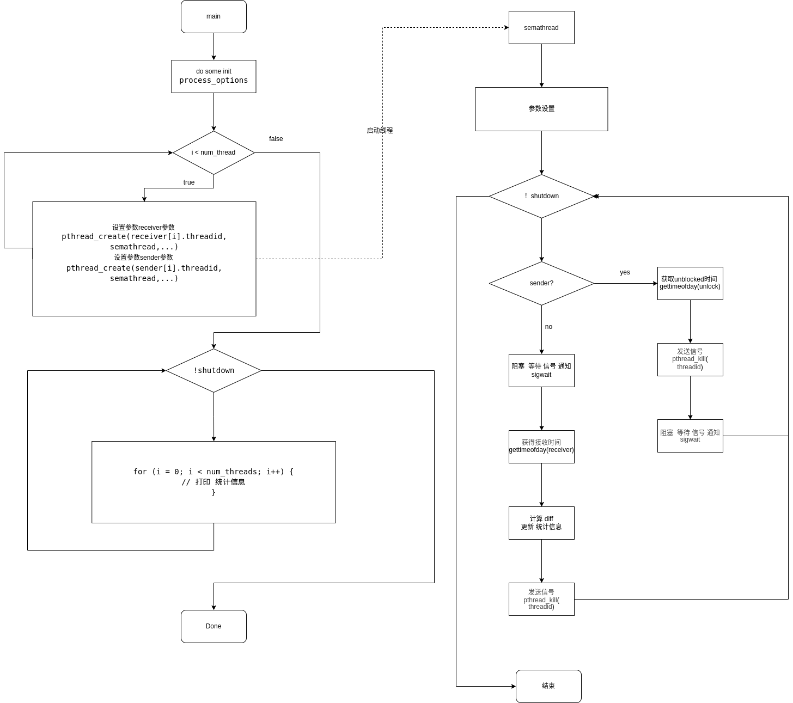

# ptsematest 文档
#  概述
测量sigwait()的时延
## 思路

启动两个线程或 fork 两个进程并测量发送和接收信号之间的延迟
## 原理

主线程 启动 一个 线程对，一个 发送 一个  接受 ， 通过 sigwait 来暂停线程 等待信号，同过kill来通知 对方运行 ， 在 sender 线程中 ，获得当前时间 发送信号，等待，在receive线程中 等待信号到来 ，然后记录当前时间。

这样 大概就可以 统计出 信号执行的延迟 
# 使用
##  编译
当rt-tests测试套件安装完成后，本程序就被安装在/usr/local/bin目录下。
```
# 编译安装rt-tests测试套件
sudo apt-get install build-essential libnuma-dev    # 安装编译环境和必需的库
git clone git://git.kernel.org/pub/scm/utils/rt-tests/rt-tests.git
cd rt-tests
git checkout stable/v1.0    # master分支不是稳定版，所以要切换到stable分支
make all
make install
```
## 参数
```
-a [NUM] --affinity 
         在处理器#N上运行线程#N，如果可能的话
         用NUM将所有线程钉在处理器NUM上
-b USEC --breaktrace=USEC 
          当延迟大于USEC时，发送中断跟踪命令
-d DIST --distance=DIST 
          线程间隔的距离，单位是us 默认=500
-f --fork 
          叉取新进程而不是创建线程
-i INTV --interval=INTV 
          线程的基本间隔，单位是us 默认=1000
-l LOOPS --loops=LOOPS 
          循环数：默认=0(无尽)
-p PRIO --prio=PRIO
          优先级
-t --threads 
          每个可用的处理器有一个线程
-t [NUM] --threads=NUM 
          线程数量。
          如果没有NUM，线程数=max_cpus
          没有 -t 默认 = 1

```
## 例子
```
# sigwaittest -a -t -p99 -i100 -d25 -l1000000
#0: ID11510, P99, CPU0, I100; #1: ID11511, P99, CPU0, Cycles 1000000
#2: ID11512, P98, CPU1, I125; #3: ID11513, P98, CPU1, Cycles 817484
#4: ID11514, P97, CPU2, I150; #5: ID11515, P97, CPU2, Cycles 668213
#6: ID11516, P96, CPU3, I175; #7: ID11517, P96, CPU3, Cycles 597344
#1 -> #0, Min    1, Cur    2, Avg    3, Max   30
#3 -> #2, Min    1, Cur   26, Avg    3, Max   42
#5 -> #4, Min    1, Cur   46, Avg    4, Max   67
#7 -> #6, Min    1, Cur    2, Avg    3, Max   74
```
## 数据含义

```
#0          标号偶数 是 接收线程
ID11510     线程id
P99         线程优先级 
CPU0        线程运行所在的cpu 
I100        唤醒数间100us
#1          标号奇数 是 发送线程 
ID11511     线程id
P99         线程优先级 
CPU0        线程运行在的cpu
Cycles      运行循环的次数

#1 -> #0, Min    1, Cur    1, Avg    2, Max   11

#1 -> #0
标号1的线程 向 标号0线程 发送消息

Min 1 
历史最小 延迟 是 1us

Cur 1
当前这次的延时 是 1us

Max 11
历史最大延迟 是 11us
```

## 性能指标
Max  
主要 观测 max 的 数值，这个数值 体现出 在系统中，当一方已经sigwait阻塞，另一方收到信号，多久能获得执行的延迟，
测试的延迟 ，综合体现了多线程调度，上下文切换，锁的性能。

# 实现方法
## 定义
线程参数  
```c
struct params {
        int num;	// 线程编号
        int num_threads;	// 全局变量num_threads的值
        int cpu;	// 线程运行的CPU
        int priority;	// 全局变量priority的值，各子线程递减1
        int affinity;	// *没有使用的字段*
        int sender;		// 0,接收者；1，发送者。
        int samples;	// 循环测量的次数
        int max_cycles;	// 全局变量max_cycles的值
        int tracelimit;	// 全局变量tracelimit的值
        int tid;		// 线程号，内核视角
        pid_t pid;		// 子进程的进程号
        int shutdown;	// 子进程/子线程应该退出的标志
        int stopped;	// 子进程/子线程已经退出的标志
        struct timespec delay;
    		// 全局变量interval的值，各子线程递增distance
        unsigned int mindiff, maxdiff;
    		// 仅receiver记录，r->diff的最小值、最大值
        double sumdiff;	// 仅receiver记录，r->diff的累加
        struct timeval unblocked, received, diff;
    		// r->diff = r->received - s->unblocked
        pthread_t threadid;		// 线程号，POSIX视角
        struct params *neighbor;	// 邻居子线程/子进程
        char error[MAX_PATH * 2];	// 如设置了-b，则记录未能访问的debugfs文件
};
```
## 方法
信号线程
```
void *semathread(void *param)
```
根据 传入的param 判断是 sender 还是  receiver 执行对应收发逻辑

## syscall

```C
#include<signal.h>
int sigwait(const sigset_t *set , int *sig);
                // Return 0 on success, or a positive error number on error
```


sigwait()会等待 set 所指信号集合中任一信号的到达，接收该信号，且在参数 sig 中
将其返回。
- 函数 sigwait()只返回信号编号，而非返回一个描述信号信息的 siginfo_t 类型结构。
- 并且返回值与其他线程相关函数保持一致（而非传统 UNIX 系统调用返回的 0 或−1）。

如有多个线程在调用 sigwait()等待同一信号，那么当信号到达时只有一个线程会实际接收
到，也无法确定收到信号的会是哪条线程。

```       
#include <signal.h>

       int pthread_kill(pthread_t thread, int sig);

```
pthread_kill 函数发送信号SIG到线程


# 实现分析

## 流程图



## 代码

__主线程__

从 main 函数入口，分析其主要运行逻辑
```C

int main(int argc, char **argv)
{
	// 声明 参数
	struct params *receiver = NULL;
	struct params *sender = NULL;

	// 处理 进程 配置选项
	process_options(argc, argv, max_cpus);
	
	// 分配 接受 和 发送 的 参数 空间
	receiver = calloc(num_threads, sizeof(struct params));
	sender = calloc(num_threads, sizeof(struct params));

	...

}
```
声明 和 分配 空间 ， 主要 用到 的  receiver ， sender 是 保存对应线程状态和参数的数组，长度 由 设定 的 线程 数目决定， sigwait pthread_kill 是这个测试 用来 测试 的主要方法，通过他们的 阻塞和发送信号，来计算延迟，从而 统计对比，内核性能。

1. `process_options()`处理用户选项。
2. `check_privs()`检查是否可以切换为实时调度。
3. `mlockall()`锁定内存。
4. `get_cpu_setup()`初始化`get_cpu()`。
5. 如mustfork置位，表示要创建子进程且当前是主进程，则为发送者子进程和接收者子进程的参数创建共享内存。
6. 如wasforked置位，表示要创建子进程且当前是子进程，则需计算出semathread()函数的参数的指针。
7. 如收到SIGINT或SIGTERM，则执行`sighand()`。
8. 进程的信号屏蔽字全部置0。
9. 如mustfork和wasforked都没有置位，表示用户没有使用-f选项，此时要创建的是子线程。则为子线程的参数创建内存空间。
10. `launchdelay`是给子线程或子进程一些时间，让它们启动。设置为10ms。
11. `maindelay`是主线程在打印循环里等待的时间。

```C
...
// 循环开启新线程
for (i = 0; i < num_threads; i++) {
		
		... 
		// 对 receiver ， 设置 参数
		...
		// 指定 sender
		receiver[i].neighbor = &sender[i];
		// 创建 新 线程 运行 semathread
		pthread_create(&receiver[i].threadid, NULL,
			    semathread, &receiver[i]);
		memcpy(&sender[i], &receiver[i], sizeof(receiver[0]));
		sender[i].sender = 1;
		// 指定receiver
		sender[i].neighbor = &receiver[i];
		// 创建 新 线程 运行 semathread
		pthread_create(&sender[i].threadid, NULL, semathread,&sender[i]);
}
...
```
接下来进入 根据 设置的线程个数 开启新线程对，对 receiver和sender 设置好参数
开启新线程，并指定 semathread 函数 作为 入口点
```C
// 统计线程 
	while (!shutdown) {
		// 主要负责 打印 开启的线程的统计信息
		...
		for (i = 0; i < num_threads; i++) {
			// 打印 统计信息
		}
		...
	}
```
在主线程内 负责 打印刚才 开启的线程的recevice 和  sender 统计信息。

__计时器线程__  
根据 sender 和 receiver ，sender 执行 计时、发送信号、阻塞 ，同时 receiver 执行 阻塞、计时、发送信号。计算两次 计时的差值，统计延迟
```C
void *semathread(void *param)
{

	...
	while (!par->shutdown) {
		// 如果是发送者
		if (par->sender) {
			... 
			// 获取时间 发送时间 unblocked
			gettimeofday(&par->unblocked, NULL);
			// 发送信号
			pthread_kill(neighbor->threadid, SIGUSR2);
			// 阻塞  等待 信号 通知
			sigwait(&sigset, &sig);
			...
		} else {
			/* Receiver */
			// 接收者
			// 阻塞  等待 信号 通知
			sigwait(&sigset, &sig);
			// 获得 时间  接收时间 received
			gettimeofday(&par->received, NULL);


			// 计算差 值  接收-发送 = 锁的延迟
			timersub(&par->received, &par->neighbor->unblocked,
			    &par->diff);
			// 更新 min  延迟 最小值
			if (par->diff.tv_usec < par->mindiff)
				par->mindiff = par->diff.tv_usec;
			// 更新 max  延迟 最大值
			if (par->diff.tv_usec > par->maxdiff)
				par->maxdiff = par->diff.tv_usec;
			par->sumdiff += (double) par->diff.tv_usec;
			
			// 发送信号 通知 sender
			pthread_kill(neighbor->threadid, SIGUSR1);
		}
	}
	par->stopped = 1;
	return NULL;
	// ...
}
```

1. 设置调度策略为SCHED_FIFO，优先级为par->priority。
2. 如用户使用了-a选项则设置亲和性，否则在随后获取当前运行的CPU。
3. 如不是子进程，则记录线程id。
4. 在for循环里进行测量循环：
   1. 如是发送者
      1. 用neighbor指向邻居的参数
      2. 如是第一轮循环，则在信号屏蔽字里设置SIGUSR1。
      3. 记录时间，准备向邻居receiver发信号SIGUSR2。
      4. 向邻居发SIGUSR2信号。
      5. 记录循环次数。
      6. 如达到用户设置的循环次数，则给par->shutdown置位。
      7. 如用户没使用-a选项，则需记录一下当前用的哪个cpu。
      8. 等SIGUSR1信号。
   2. 如是接收者
      1. 用neighbor指向邻居的参数
      2. 如是第一轮循环，则在信号屏蔽字里设置SIGUSR2。
      3. 等信号SIGUSR2。
      4. 记录接收到信号的时间。
      5. 记录循环次数。
      6. 如达到用户设置的循环次数，则给par->shutdown置位。
      7. 如用户没使用-a选项，则需记录一下当前用的哪个cpu。
      8. 记录测量到的参数。
      9. 如用户使用了-b参数，且超过了用户的限制，则向debugfs的tracing_enabled文件写入0，并准备退出。
      10. 睡眠，让发送者邻居等一等。
      11. 给发送者邻居发SIGUSR1，表示可进行下一轮循环测量了。
5. par->stopped置1表示退出

# 引用