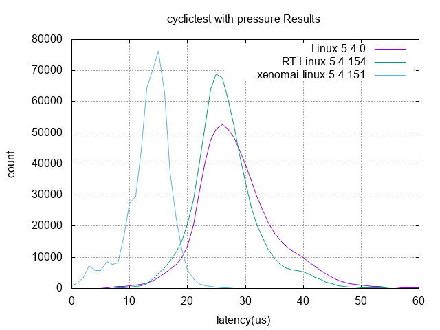
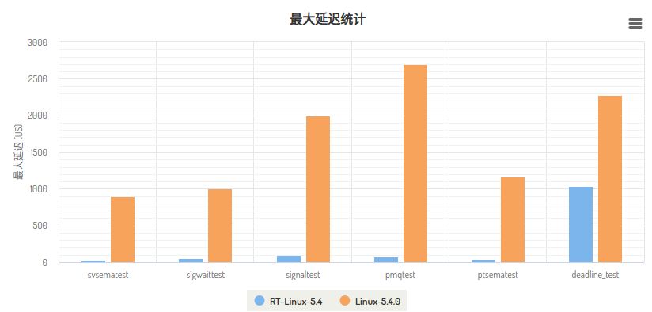

### 编译与配置

Linux preempt rt编译文档：

[https://shimo.im/docs/RKAWVQEa2jhJ44k8](https://shimo.im/docs/RKAWVQEa2jhJ44k8)

Xenomai编译文档：

[https://shimo.im/docs/dPkpKZN1Rxtgb8qO](https://shimo.im/docs/dPkpKZN1Rxtgb8qO)

### NUC空载测试

```bash
# 测试命令
cyclictest -m -l 10000000 -i 100 -q -t 1 -n -p99  # 非CPU绑定
cyclictest -a 0 -m -l 10000000 -i 100 -q -t 1 -n -p99  # CPU绑定
```
**结果**：
|    |非CPU绑定(min,act,avg,max)|CPU绑定(min,act,avg,max)|
|:----|:----|:----|
|generic linux|3, 12, 11, 2887|3, 9, 11, 2864|
|rt-linux|3, 10, 13, 278|4, 14, 14, 96|
|xenomai|5, 22, 20, 2704|6, 22, 19, 2405|

异常结果分析：

由于未找到xenomai版的cyclictest，xenomai上的测试是运行在linux核上的，导致xenomai的结果异常。

### NUC负载测试

**测试硬件**：

Intel Celeron CPU J3455 @ 1.50GHz 4核

8G内存

256G 固态硬盘

**测试平台**：

基于Ubuntu 18.04.6 LTS

   

* cyclictest 高精度的实时OS的延迟测试。
**测试命令与参数：**

```bash
# 添加高CPU、磁盘IO负载(CPU占用约100%)
while true; do dd if=/dev/zero of=bigfile bs=1024000 count=1024; done &
while true; do killall hackbench; sleep 5; done &
while true; do hackbench 20; done &

# 测试使用了xenomai的编译系统，基于libcobalt编译出cyclictest
cyclictest -m -h 100 -q -l 10000000 -i 10000 -d 86400 -t 1 -n -p 80 -D 2h

```
**结果数据：**
|OS|Min Latencies|Avg Latencies|Max Latencies|
|:----|:----|:----|:----|
|xenomai-Linux|0|12|40|
|RT-Linux-5.4.154|6|26|110|
|Linux-5.4.0|5|30|2839|

**测试数据分布统计：**



注：例如，在CPU和磁盘IO高负载情况下，xenomai的延时为15毫秒在总测试循环中出现了76185次。

参考：

实时性测试：cyclictest详解

[https://zhuanlan.zhihu.com/p/336381111](https://zhuanlan.zhihu.com/p/336381111)


* svsematest 开两个线程测试SYSV信号量的延迟
**测试命令与参数：**

```plain
svsematest -a -t1 -p99 -i100 -d25 -l1000000 
```
**结果数据：**
|OS|Min Latencies|Avg Latencies|Max Latencies|
|:----|:----|:----|:----|
|RT-Linux-5.4.154|3|4|32|
|Linux-5.4.0|2|3|896|

* sigwaittest 开两个线程测试发送和接收信号之间的延迟
**测试命令与参数：**

```plain
sigwaittest -a -t1 -p99 -i100 -d25 -l1000000
```
**结果数据：**
|OS|Min Latencies|Avg Latencies|Max Latencies|
|:----|:----|:----|:----|
|RT-Linux-5.4.154|4|6|59|
|Linux-5.4.0|3|4|1005|

* signaltest 信号往返测试
**测试命令与参数：**

```plain
signaltest -l1000000 -p99 
```
**结果数据：**
|OS|Min Latencies|Avg Latencies|Max Latencies|
|:----|:----|:----|:----|
|RT-Linux-5.4.154|12|21|92|
|Linux-5.4.0|5|21|2001|

* pmqtest 开启多对线程，测试POSIX消息队列的进程间通信的延迟
**测试命令与参数：**

```plain
pmqtest -p99 -i100 -d0 -t1
```
**结果数据：**
|OS|Min Latencies|Avg Latencies|Max Latencies|
|:----|:----|:----|:----|
|RT-Linux-5.4.154|4|12|73|
|Linux-5.4.0|3|11|2697|

* ptsematest 开启两个线程，测试POSIX互斥量的进程间通信的延迟
**测试命令与参数：**

```plain
ptsematest -a -t1 -p99 -i100 -d25 -l1000000
```
**结果数据：**
|OS|Min Latencies|Avg Latencies|Max Latencies|
|:----|:----|:----|:----|
|RT-Linux-5.4.154|3|4|45|
|Linux-5.4.0|2|3|1163|

* deadline_test 高精度测试deadline调度器
**测试命令与参数：**

```plain
deadline_test -t 1
```
**结果数据：**
|OS|Min time|Avg time|Max time|
|:----|:----|:----|:----|
|RT-Linux-5.4.154|865|878|1031|
|Linux-5.4.0|872|892|2274|

**上列测试数据的最大延迟统计：**




* rt-migrate-test 实时任务迁移测试，确保最高优先级的任务运行在所有可用的CPU上
**测试命令与参数：**

```plain
rt-migrate-test 1
```
**结果数据：**
|OS|Min Latencies|Avg Latencies|Max Latencies|Tot|
|:----|:----|:----|:----|:----|
|RT-Linux-5.4.154|29|41|57|2077|
|Linux-5.4.0|33|43|74|2168|

* cyclicdeadline 使用一个cyclictest样式的程序测试deadline调度器
**测试命令与参数：**

```plain
cyclicdeadline -t 1
```
**结果数据：**
|OS|Min|Avg|Max|
|:----|:----|:----|:----|
|RT-Linux-5.4.154|2|15|67|
|Linux-5.4.0|1|39539|61180|

* ssdd 让一个跟踪程序执行一系列PTRACE SINGLESTEP
```plain
ssdd
```

|OS|    |
|:----|:----|
|RT-Linux-5.4.154|All tests PASSED.|
|Linux-5.4.0|All tests PASSED.|

* oslat OS延迟探测
**测试命令与参数：**

```plain
oslat
```
**结果数据：**
|OS|Min Latencies|Avg Latencies|Max Latencies|
|:----|:----|:----|:----|
|RT-Linux-5.4.154|1|1.144|203244|
|Linux-5.4.0|1|1.187|306009|

* hackbench 调度器压力测试，提供系统负载
**测试命令与参数：**

```plain
hackbench -s 512 -l 200 -g 15 -f 25 -P
```

|OS|Time|
|:----|:----|
|RT-Linux-5.4.154|2.994|
|Linux-5.4.0|2.065|

* pip_stress 进程的优先级继承
**测试命令与参数：**

```plain
pip_stress
```
**结果数据：**
|OS|Inversion|
|:----|:----|
|RT-Linux-5.4.154|Successfully used priority inheritance to handle an inversion|
|Linux-5.4.0|Successfully used priority inheritance to handle an inversion|

* pi_stress POSIX优先级继承互斥量的压力测试
**测试命令与参数：**

```plain
pi_stress --verbose --duration 60
```
**结果数据：**
|OS|Total inversion performed|
|:----|:----|
|RT-Linux-5.4.154|3590830|
|Linux-5.4.0|5032694|

Reference：

信号量优先级反转[https://www.jianshu.com/p/c1f7aa944dda](https://www.jianshu.com/p/c1f7aa944dda)

* queuelat 队列延迟测试
```plain
taskset -c 3 ./queuelat -m 20000 -c 100 -p 13 -f `sh ./get_cpuinfo_mhz.sh` #如 1500 MHz
```


|OS|Min time|Avg time|Max time|
|:----|:----|:----|:----|
|RT-Linux-5.4.154|10100|10791|70099|
|Linux-5.4.0|10400|12002|15399|


* hwlatdetect    ftrace内核硬件延时检测，检测SMI(System Management interrupt)是否导致Linux RT内核的事件延迟。
```plain
insmod ./hwlat.ko enabled=1 threshold=100 #缺少该内核模块
hwlatdetect --duration=1m --debug --watch
```

